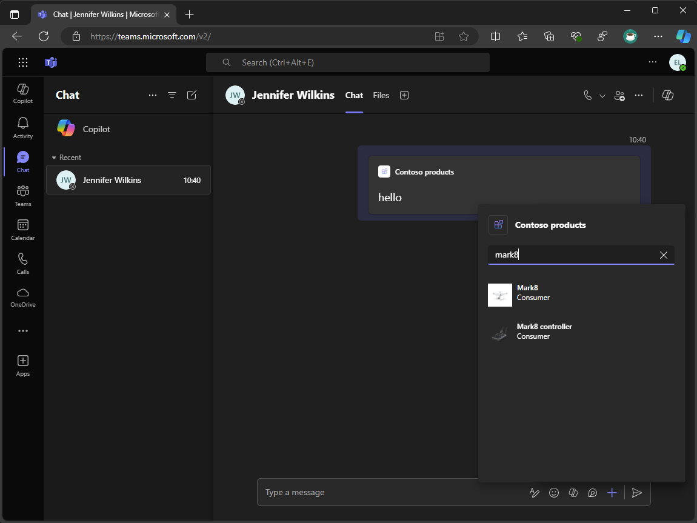

---
lab:
  title: Introducción
  module: 'LAB 01: Connect Copilot for Microsoft 365 to your external data in real-time with message extension plugins built with .NET and Visual Studio'
---

# Introducción

Las extensiones de mensajes permiten a los usuarios trabajar con sistemas externos de Microsoft Teams y Microsoft Outlook. Los usuarios pueden usar las extensiones de mensajes para buscar, cambiar y compartir datos de estos sistemas en mensajes y correos electrónicos como una tarjeta con formato enriquecido.

Supongamos que tienes una API personalizada que usas para acceder a la información de producto actual y relevante para tu organización. Deseas buscar y compartir esta información en Microsoft 365. También deseas que Copilot para Microsoft 365 use esta información en sus respuestas.

En este módulo, crearás una extensión de mensajes. La extensión de mensajes usa un bot para comunicarse con Microsoft Teams, Microsoft Outlook y Copilot para Microsoft 365.

Usa Microsoft Entra para autenticar a los usuarios, lo que le permite devolver datos de la API en su nombre.

Una vez que el usuario se autentique, la extensión de mensajes obtendrá datos de la API y devolverá resultados de búsqueda que se pueden insertar en mensajes y correos electrónicos como una tarjeta con formato enriquecido, que se compartirá.

Funciona con Copilot para Microsoft 365 como complemento, lo que le permite consultar los datos de producto en nombre del usuario y usar los datos devueltos en sus respuestas.

Al final de este módulo, podrás crear extensiones de mensajes escritas en C# (que se ejecutan en .NET). Se puede usar en Microsoft Teams, Microsoft Outlook y Copilot para Microsoft 365. Puede consultar datos detrás de las API protegidas y devolver los resultados como tarjetas con formato enriquecido.

## Requisitos previos

- Conocimientos básicos de C#
- Conocimientos básicos de Bicep
- Conocimientos básicos de la autenticación
- Acceso de administrador a un inquilino de Microsoft 365
- Acceso a una suscripción de Azure
- El acceso a Copilot para Microsoft 365 es opcional y solo se requiere para completar el **Ejercicio 4: Tarea 5**.
- Visual Studio 2022 17.10+ con el [kit de herramientas de Teams](/microsoftteams/platform/toolkit/toolkit-v4/teams-toolkit-fundamentals-vs) (componente de herramientas de desarrollo de Microsoft Teams) instalado
- [.NET 8.0](https://dotnet.microsoft.com/download/dotnet/8.0)
- [Proxy de desarrollo 0.19.1+](https://aka.ms/devproxy)

> [!NOTE]
> El único ejercicio de este laboratorio que requiere una licencia de Microsoft 365 Copilot es el **Ejercicio 4: Tarea 5**. Todo hasta ese punto debe hacerse tanto si el inquilino tiene Copilot como si no.

## Duración del laboratorio

  - **Tiempo estimado para completarla:** 150 minutos

## Objetivos de aprendizaje

Al término de este módulo, podrá:

- Comprender qué son las extensiones de mensajes y cómo crearlas.
- Crear una extensión de mensajes.
- Comprender cómo autenticar a los usuarios mediante el inicio de sesión único y llamar a una API personalizada protegida con la autenticación de Microsoft Entra.
- Comprender cómo ampliar y optimizar las extensiones de mensajes para su uso con Copilot para Microsoft 365.

Cuando estés listo para comenzar, selecciona [ir al primer ejercicio...](./2-exercise-create-a-message-extension.md)
