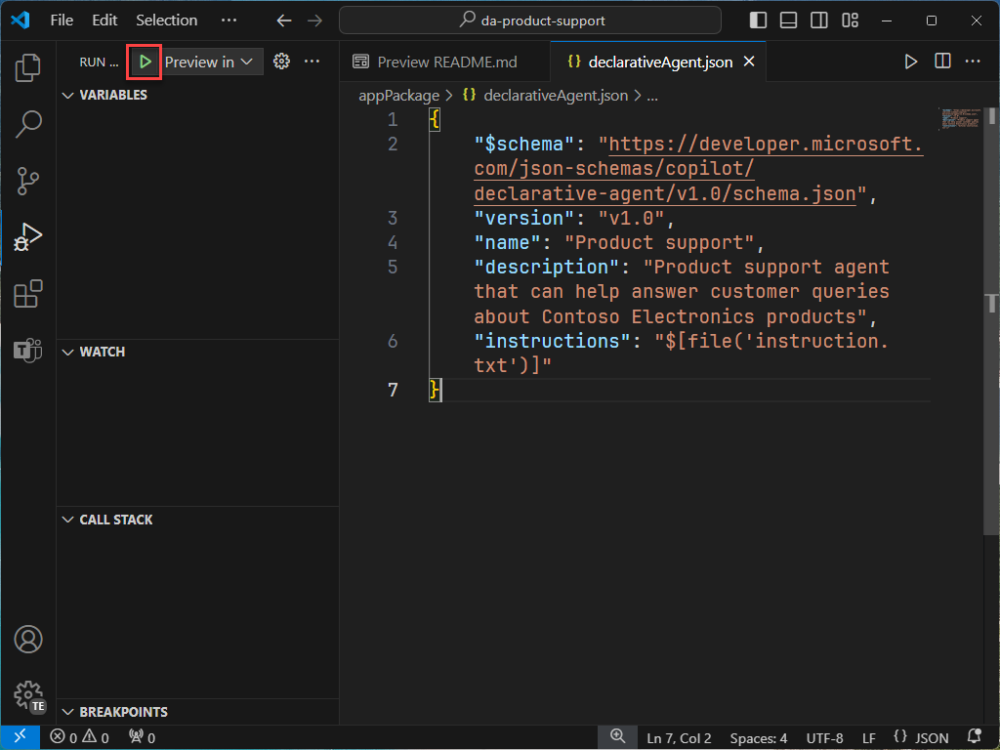
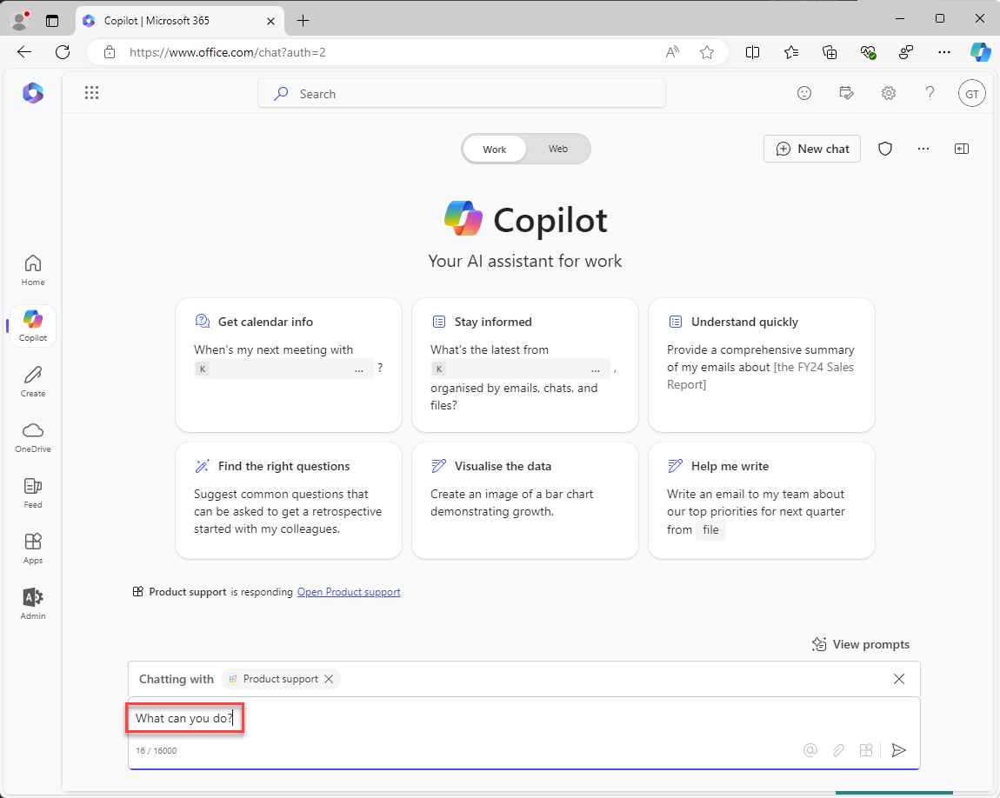

---
lab:
  title: 'Ejercicio 1: Creación de un agente declarativo en Visual Studio Code'
  module: 'LAB 01: Build a declarative agent for Microsoft 365 Copilot using Visual Studio Code'
---

# Ejercicio 1: Creación de un agente declarativo

En este ejercicio, crearás un proyecto de agente declarativo a partir de una plantilla, actualizarás el manifiesto, cargarás el agente en Microsoft 365 y lo probarás en Microsoft 365 Copilot. 

El agente declarativo se implementa en una aplicación de Microsoft 365. Crea un paquete de aplicación que contenga:

- app.manifest.json: el archivo de manifiesto de la aplicación describe cómo se configura la aplicación, incluidas sus funcionalidades.
- declarative-agent.json: el manifiesto del agente declarativo describe cómo se configura el agente declarativo.
- color.png y outline.png: un icono de color y esquema usado para representar el agente declarativo en la interfaz de usuario de Microsoft 365 Copilot.

### Duración del ejercicio

- **Tiempo estimado para completarlo**: 15 minutos

## Tarea 1: Descarga del proyecto de inicio

Empieza descargando el proyecto de ejemplo de GitHub en un explorador web:

1. Ve al repositorio de plantilla [https://github.com/microsoft/learn-declarative-agent-vscode](https://github.com/microsoft/learn-declarative-agent-vscode).
    1. Sigue los pasos para [descargar el código fuente del repositorio](https://docs.github.com/repositories/working-with-files/using-files/downloading-source-code-archives#downloading-source-code-archives-from-the-repository-view) en el equipo.
    1. Extrae el contenido del archivo ZIP descargado en tu **carpeta de Documentos**.

El proyecto de inicio contiene un proyecto del Teams Toolkit que incluye un agente declarativo.

1. Abre la carpeta de proyecto en Visual Studio Code.
1. En la carpeta raíz del proyecto, abre el archivo **README.md**. Examina el contenido para obtener más información sobre la estructura del proyecto.


## Tarea 2: Examen del manifiesto del agente declarativo

Vamos a examinar el archivo de manifiesto del agente declarativo:

- Abre el archivo **appPackage/declarativeAgent.json** y examina el contenido:

    ```json
    {
        "$schema": "https://aka.ms/json-schemas/agent/declarative-agent/v1.0/schema.json",
        "version": "v1.0",
        "name": "da-product-support",
        "description": "Declarative agent created with Teams Toolkit",
        "instructions": "$[file('instruction.txt')]"
    }
    ```

El valor de la propiedad **instructions** contiene una referencia a un archivo denominado **instruction.txt**. El Teams Toolkit proporciona la función **$[file(path)]**. El contenido de **instruction.txt** se incluye en el archivo de manifiesto del agente declarativo cuando se aprovisiona en Microsoft 365.

- En la carpeta **appPackage**, abre el archivo **instruction.txt** y revisa el contenido:

    ```md
    You are a declarative agent and were created with Team Toolkit. You should start every response and answer to the user with "Thanks for using Teams Toolkit to create your declarative agent!\n\n" and then answer the questions and help the user.
    ```

## Tarea 3: Actualización del manifiesto del agente declarativo

Vamos a actualizar las propiedades **name** y **description** para que sean más relevantes para nuestro escenario.

1. En la carpeta **appPackage**, abre el archivo **declarativeAgent.json**.
1. Actualiza el valor de la propiedad **name** a **Soporte técnico del producto**.
1. Actualiza el valor de propiedad **description** a **Agente de soporte técnico del producto que puede ayudar con las consultas de los clientes sobre los productos de Contoso Electronics**.
1. Guarda los cambios

El archivo cargado debe tener el siguiente contenido:

```json
{
    "$schema": "https://aka.ms/json-schemas/agent/declarative-agent/v1.0/schema.json",
    "version": "v1.0",
    "name": "Product support",
    "description": "Product support agent that can help answer customer queries about Contoso Electronics products",
    "instructions": "$[file('instruction.txt')]"
}
```

## Tarea 4: Carga del agente declarativo en Microsoft 365

> [!IMPORTANT]
> Antes de empezar, asegúrate de que tienes instalada la extensión Teams Toolkit en Visual Studio Code. Si aún no has instalado la extensión desde Marketplace, hazlo ahora.

Luego, carga el agente declarativo en el inquilino de Microsoft 365.

En Visual Studio Code:

1. En la **barra Activity**, abre la extensión **Teams Toolkit**.

    

1. Selecciona **Provision** en la sección **Lifecycle**.

    

1. En la solicitud, selecciona **Sign In** y sigue las indicaciones para iniciar sesión en el inquilino de Microsoft 365 con el Teams Toolkit. El proceso de aprovisionamiento se inicia automáticamente después de iniciar sesión.

    

    

1. Para continuar, espera a que se complete la carga.

    

Luego, revisa la salida del proceso de aprovisionamiento.

- En la carpeta **appPackage/build**, abre el archivo **declarativeAgent.dev.json**.

Observa que el valor de propiedad **instructions** contiene el contenido del archivo **instruction.txt**. Se incluye el archivo **declarativeAgent.dev.json** en el archivo **appPackage.dev.zip** junto con los archivos **manifest.dev.json**, **color.png** y **outline.png**. Se carga el archivo **appPackage.dev.zip** en Microsoft 365.

## Tarea 5: Prueba del agente declarativo en Microsoft 365 Copilot

A continuación, vamos a ejecutar el agente declarativo en Microsoft 365 Copilot y validar su funcionalidad tanto en la experiencia **en contexto** como en la experiencia **envolvente**.

En Visual Studio Code:

1. En la **barra Activity**, cambia a la vista **Run and Debug**.

    

1. Selecciona el botón **Start Debugging** situado junto al elemento desplegable de la configuración o presiona <kbd>F5</kbd>. Se inicia una nueva ventana del explorador y navega a Microsoft 365 Copilot.

    

    

    

Seguimos en el explorador, donde probaremos la experiencia **en contexto**.

1. En **Microsoft 365 Copilot**, en el cuadro de mensaje, escribe el símbolo <kbd>@</kbd>. Aparece un control flotante con la lista de agentes disponibles.

    

1. En el control flotante, selecciona **Soporte técnico del producto**. Observa el mensaje de estado situado encima del cuadro de mensaje. Muestra **Hablando con el soporte técnico del producto**, lo que significa que usa la experiencia en contexto del agente.

    

1. En el cuadro de texto, escribe **¿Qué puedes hacer?** y envía el mensaje.

    

1. Espera la respuesta. Observa cómo comienza la respuesta con el texto "Gracias por usar el Teams Toolkit para crear el agente declarativo". tal como se define en las instrucciones que has revisado anteriormente.

    

1. Para salir de la experiencia en contexto, selecciona la cruz (X) en el mensaje de estado. Observa que se quita el mensaje de estado y se muestra un mensaje en la ventana de chat que indica que ya no estás chateando con el agente.

    

    

Por último, vamos a probar la experiencia **envolvente**.

Continúa en el explorador:

1. En **Microsoft 365 Copilot**, selecciona el icono de la parte superior derecha para expandir el panel lateral de Copilot. Observa que el panel muestra los chats recientes y los agentes disponibles.

    

1. En el panel lateral, selecciona **Soporte técnico del producto** para entrar en la experiencia inmersiva y chatear directamente con el agente. Observa dos solicitudes de ejemplo que se muestran en la interfaz.

    

1. Selecciona la solicitud de muestra con el título **Más información**. Observa que el texto **¿Qué puede hacer?** se agrega al cuadro de mensaje automáticamente.

    

1. Envía el mensaje y espera la respuesta. Observa cómo comienza la respuesta con el texto "Gracias por usar el kit de herramientas de Teams para crear el agente declarativo." tal como se define en las instrucciones que has revisado anteriormente.

    

Por último, cierra el explorador para detener la sesión de depuración en Visual Studio Code.