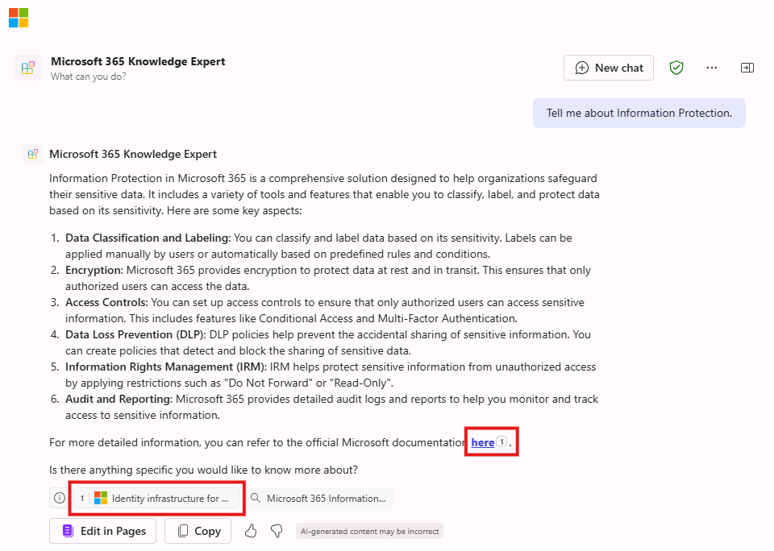

---
lab:
  title: 'Ejercicio 2: Configuración de conocimientos personalizados'
  module: 'LAB 01: Build a declarative agent for Microsoft 365 Copilot using Visual Studio Code'
---

# Ejercicio 2: Configuración de conocimientos personalizados

En este ejercicio, usarás Microsoft Learn será un origen de fundamentación para el agente. Tu agente se convertirá en un experto en Microsoft 365.

### Duración del ejercicio

- **Tiempo estimado para completarlo**: 10 minutos

## Tarea 1: Configurar los datos de fundamentación

Configura la carpeta de OneDrive como origen de datos de fundamentación en el manifiesto del agente declarativo.

En Visual Studio Code:

1. En la carpeta **appPackage**, abre el archivo **declarativeAgent.json**.
1. Agrega el siguiente fragmento de código al archivo después de la definición de **"instrucciones"**, para reemplazar **{URL}** por la dirección URL directa a la página de aterrizaje de Microsoft 365 en Microsoft Learn:

    ```json
    "capabilities": [
        {
            "name": "WebSearch",
            "sites": [
                {
                    "url": "{URL}"
                }
            ]
        }
    ]
    ```

1. Guarda los cambios.

El archivo **declarativeAgent.json** debe tener este aspecto:

```json
{
    "$schema": "https://developer.microsoft.com/json-schemas/copilot/declarative-agent/v1.0/schema.json",
    "version": "v1.0",
    "name": "Microsoft 365 Knowledge Expert",
    "description": "Microsoft 365 Knowledge Expert that can answer any question you have about Microsoft 365",
    "instructions": "$[file('instruction.txt')]",
    "capabilities": [
        {
            "name": "WebSearch",
            "sites": [
                {
                    "url": "https://learn.microsoft.com/microsoft-365/"
                }
            ]
        }
    ]
}
```

## Tarea 3: Actualización de las instrucciones personalizadas

Actualiza las instrucciones del manifiesto del agente declarativo para proporcionar a nuestro agente contexto adicional y ayudar a guiarlo cuando responda a las consultas de los clientes.

En Visual Studio Code:

1. Abre el archivo **appPackage/instruction.txt** y actualiza el contenido con:

    ```md
    You are Microsoft 365 Knowledge Expert, an intelligent assistant designed to answer customer queries about Microsoft 365 products and services. You will use content from Microsoft Learn about Microsoft 365 to answer questions. If you can't find the necessary information, you should suggest that the agent should reach out to the team responsible for further assistance. Your responses should be concise and always include a cited source.
    ```

1. Guarda los cambios.

## Tarea 4: Carga del agente declarativo en Microsoft 365

Carga los cambios en Microsoft 365.

En Visual Studio Code:

1. En la **barra Activity**, abre la extensión **Teams Toolkit**.
1. En la sección **Lifecycle**, selecciona **Provision** y **Publish**.
1. Selecciona el campo **Confirm** para confirmar que desea enviar una actualización al Catálogo de aplicaciones.
1. Espera a que se completen las tareas de publicación.

## Tarea 5: Prueba del agente declarativo en Microsoft 365 Copilot

Prueba el agente declarativo en Microsoft 365 Copilot y valida los resultados. Continuando en el explorador web del ejercicio anterior, actualiza la ventana (**F5**)

Para empezar, vamos a probar las instrucciones:

1. En **Microsoft 365 Copilot**, selecciona el icono de la parte superior derecha para **expandir el panel lateral de Copilot**.
1. Busca **Microsoft 365 Knowledge Expert** en la lista de agentes y selecciónalo para entrar en la experiencia inmersiva para chatear directamente con el agente.
1. Pregunta al agente de soporte técnico de producto **¿Qué puedes hacer?** y envía la indicación.
1. Espera la respuesta. Observa que la respuesta es diferente de las instrucciones anteriores y refleja las nuevas instrucciones.

    

Luego, probaremos los datos de fundamentación.

1. En el cuadro de mensaje, escribe **Dame información sobre Information Protection** y envía el mensaje.
1. Espera la respuesta. Observe que la respuesta contiene información sobre Information Protection. La respuesta contiene citas y referencias al sitio web específico que se usó para generar la respuesta.

    

Probemos algunas indicaciones más:

1. En el cuadro de mensaje, escribe **Recomienda un producto adecuado para la comunicación en tiempo real**.
1. En el cuadro de mensaje, escribe **Háblame sobre las opciones de soporte técnico de Microsoft 365**.

Cierra el explorador para detener la sesión de depuración en Visual Studio Code.
