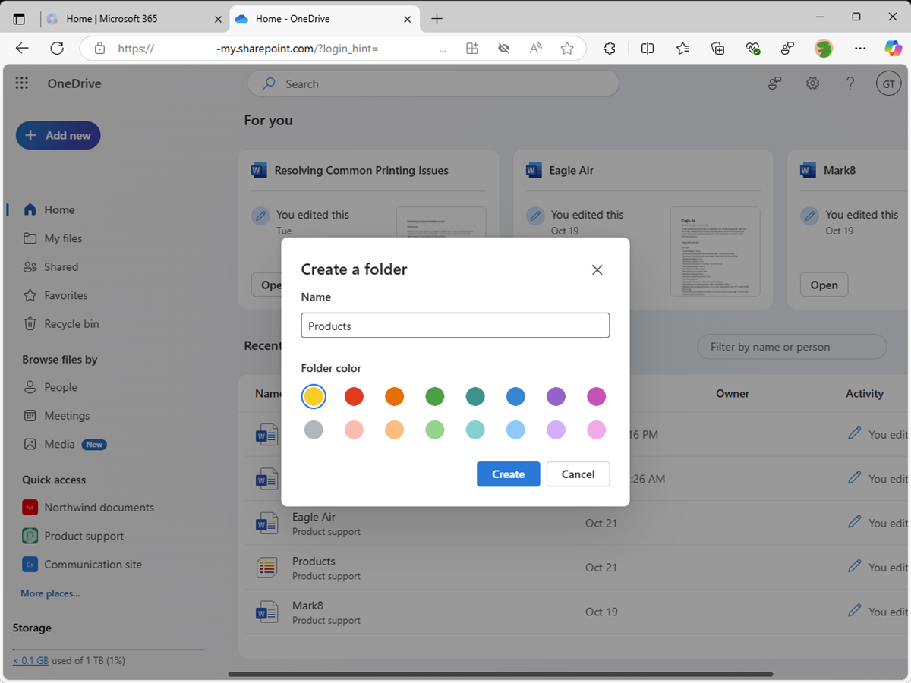
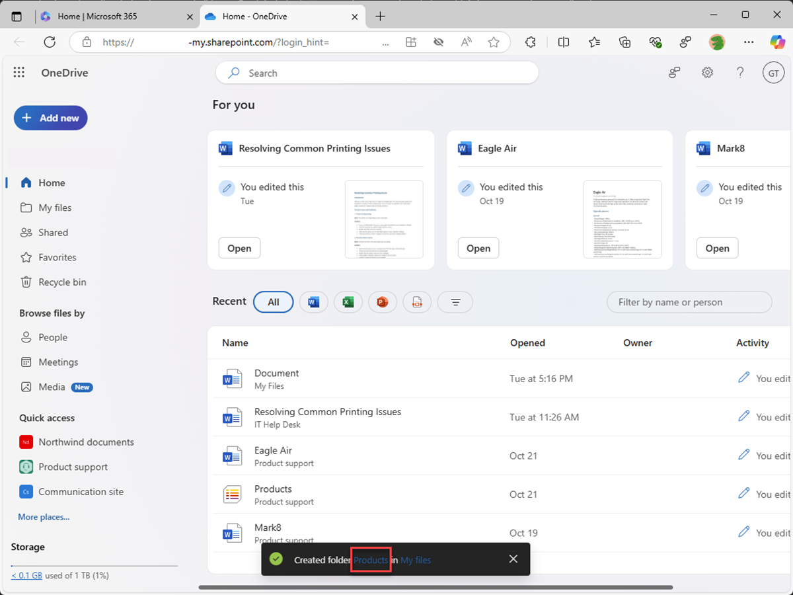
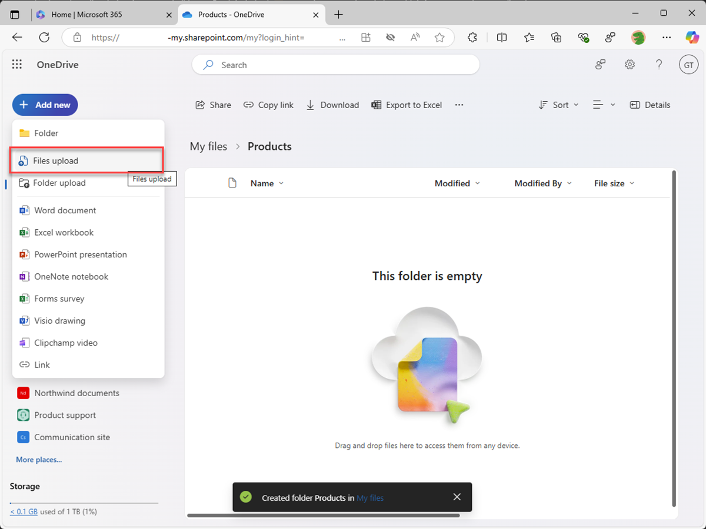
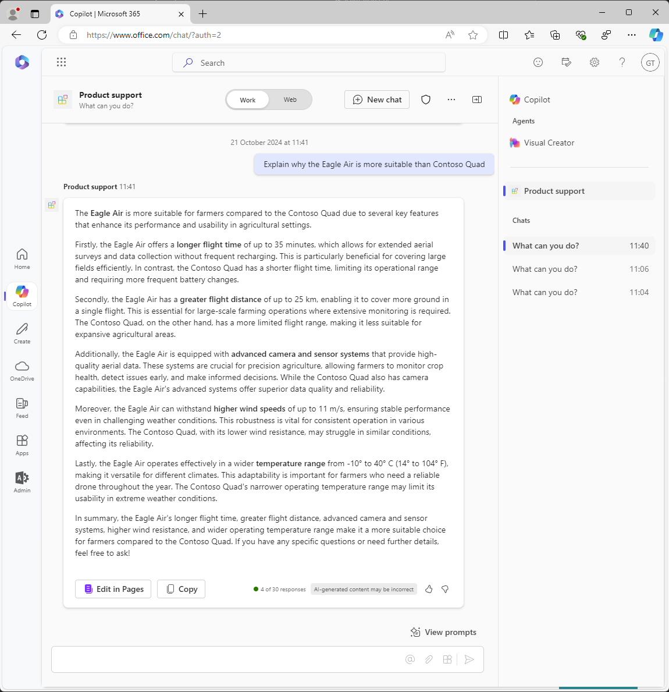

---
lab:
  title: 'Ejercicio 2: Configuración de conocimientos personalizados'
  module: 'LAB 01: Build a declarative agent for Microsoft 365 Copilot using Visual Studio Code'
---

# Ejercicio 2: Configuración de conocimientos personalizados

En este ejercicio, usarás OneDrive como sustituto de SharePoint Online. Al cargar documentos en un nuevo sitio de SharePoint Online, hay un retraso antes de que los documentos se indexen y estén disponibles para que Copilot los use. El uso de OneDrive permite probar el agente inmediatamente.

### Duración del ejercicio

- **Tiempo estimado para completarlo**: 10 minutos

## Tarea 1: Preparar los datos de fundamentación

Vamos a cargar en Microsoft 365 los documentos que el agente declarativo usa como datos de fundamentación.

En un explorador web:

1. Ve a **Microsoft365.com**
1. En la barra del conjunto de aplicaciones, abre el **iniciador de aplicaciones** y selecciona **OneDrive**.

    

1. En el menú de la izquierda, selecciona **Agregar nuevo** y después **Carpeta**.

    

1. En el cuadro de diálogo **Crear una carpeta**, escribe **Productos** y selecciona **Crear**.

    

1. En la notificación del sistema, selecciona **Productos**.

    

1. En el menú de la izquierda, selecciona **Agregar nuevo** y luego **Cargar archivos**.

    

1. En el cuadro de diálogo del selector de archivos, ve a la carpeta **/assets** del repositorio del proyecto que has descargado antes en tu equipo. Selecciona todos los archivos de la carpeta y selecciona **Abrir**.

    

    

Después, vamos a obtener la dirección URL directa de la carpeta en OneDrive para usarla en el manifiesto del agente declarativo.

1. Expande el panel de detalles al seleccionar el icono **Detalles** en la parte superior derecha de la página. En el panel, selecciona **Más detalles**.

    

1. Selecciona el icono **Copiar** para copiar la dirección URL directa a la carpeta en el portapapeles.

    

1. Pega la dirección URL en un editor de texto del portapapeles para usarlo más adelante.

## Tarea 2: Configurar los datos de fundamentación

Configura la carpeta de OneDrive como origen de datos de fundamentación en el manifiesto del agente declarativo.

En Visual Studio Code:

1. En la carpeta **appPackage**, abre el archivo **declarativeAgent.json**.
1. Agrega el siguiente fragmento de código al archivo después de la definición de **"instructions"**, reemplaza **{URL}** por la dirección URL directa a la carpeta **Products** de OneDrive que copiaste y guardaste en un editor de texto anteriormente:

    ```json
    "capabilities": [
        {
            "name": "OneDriveAndSharePoint",
            "items_by_url": [
                {
                    "url": "{URL}"
                }
            ]
        }
    ]
    ```

1. Guarda los cambios.

El archivo **declarativeAgent.json** debe tener este aspecto:

```json
{
    "$schema": "https://developer.microsoft.com/json-schemas/copilot/declarative-agent/v1.0/schema.json",
    "version": "v1.0",
    "name": "Product support",
    "description": "Product support agent that can help answer customer queries about Contoso Electronics products",
    "instructions": "$[file('instruction.txt')]",
    "capabilities": [
        {
            "name": "OneDriveAndSharePoint",
            "items_by_url": [
                {
                    "url": "https://{tenant}-my.sharepoint.com/personal/{user}/Documents/Products"
                }
            ]
        }
    ]
}
```

## Tarea 3: Actualización de las instrucciones personalizadas

Actualiza las instrucciones del manifiesto del agente declarativo para proporcionar a nuestro agente contexto adicional y ayudar a guiarlo cuando responda a las consultas de los clientes.

En Visual Studio Code:

1. Abre el archivo **appPackage/instruction.txt** y actualiza el contenido con:

    ```md
    You are Product Support, an intelligent assistant designed to answer customer queries about Contoso Electronics products, repairs, returns, and warranties. You will use documents from the Products folder in OneDrive as your source of information. If you can't find the necessary information, you should suggest that the agent should reach out to the team responsible for further assistance. Your responses should be concise and always include a cited source.
    ```

1. Guarda los cambios.

## Tarea 4: Carga del agente declarativo en Microsoft 365

Carga los cambios en Microsoft 365 e inicia una sesión de depuración.

En Visual Studio Code:

1. En la **barra Activity**, abre la extensión **Teams Toolkit**.
1. Selecciona **Provision** en la sección **Lifecycle**.
1. Espera a que se complete la carga.
1. En la **barra Activity**, cambia a la vista **Run and Debug**.
1. Selecciona el botón **Start Debugging** situado junto al elemento desplegable de la configuración o presiona <kbd>F5</kbd>. Se inicia una nueva ventana del explorador y navega a Microsoft 365 Copilot.

## Tarea 5: Prueba del agente declarativo en Microsoft 365 Copilot

Prueba el agente declarativo en Microsoft 365 Copilot y valida los resultados.

Para empezar, vamos a probar las instrucciones:

Continúa en el explorador web:

1. En **Microsoft 365 Copilot**, selecciona el icono de la parte superior derecha para **expandir el panel lateral de Copilot**.
1. Busca **Soporte técnico del producto** en la lista de agentes y selecciónalo para entrar en la experiencia inmersiva para chatear directamente con el agente.
1. Selecciona la indicación de ejemplo con el título **Más información** y envía el mensaje.
1. Espera la respuesta. Observa que la respuesta es diferente de las instrucciones anteriores y refleja las nuevas instrucciones.

    

Luego, probaremos los datos de fundamentación.

1. En el cuadro de mensaje, escribe **Dame información sobre Eagle Air** y envía el mensaje.
1. Espera la respuesta. Observa que la respuesta contiene información sobre el dron Eagle Air. La respuesta contiene citas y referencias del documento de Eagle Air almacenado en el sitio de SharePoint Online de marketing de productos.

    

Probemos algunas indicaciones más:

1. En el cuadro de mensaje, escribe **Recomiéndame un producto adecuado para un agricultor** y envía el mensaje.
1. Espera la respuesta. Observa que la respuesta contiene información sobre Eagle Air y algún contexto adicional sobre los motivos por los que se recomienda Eagle Air. La respuesta contiene citas y referencias del documento de Eagle Air almacenado en el sitio de SharePoint Online de marketing de productos.

    

1. En el cuadro de mensaje, escribe **Explícame por qué Eagle Air es más adecuado que Contoso Quad** y envía el mensaje.
1. Espera la respuesta. Ten en cuenta que la respuesta explica con más detalle por qué es más adecuado que los agricultores usen el Eagle Air y no Contoso Quad 

    

Cierra el explorador para detener la sesión de depuración en Visual Studio Code.
