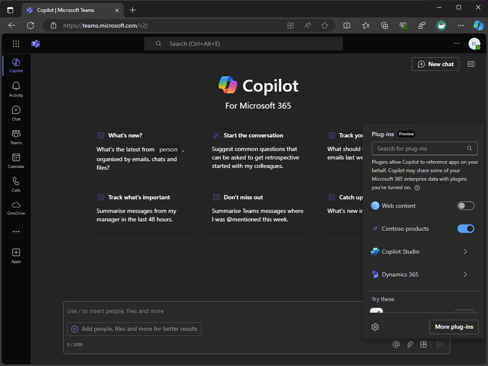

---
lab:
  title: 'Ejercicio 4: Ampliación y optimización de las extensiones de mensajes para su uso con Copilot para Microsoft 365'
  module: 'LAB 01: Connect Copilot for Microsoft 365 to your external data in real-time with message extension plugins built with .NET and Visual Studio'
---

# Ejercicio 4: Ampliación y optimización de las extensiones de mensajes para su uso con Copilot para Microsoft 365

En este ejercicio, ampliarás y optimizarás la extensión de mensajes para su uso con Copilot para Microsoft 365. Agregarás un nuevo parámetro denominado Target Audience y actualizarás la lógica de la extensión de mensajes para controlar varios parámetros. Por último, ejecutarás y depurarás la extensión de mensajes y la probarás en Copilot en Microsoft Teams.


> [!NOTE]
> La Tarea 5 es la única tarea de este ejercicio que requiere una licencia de Microsoft 365 Copilot. Las tareas anteriores deben realizarse tanto si el inquilino tiene Copilot como si no.

### Duración del ejercicio

  - **Tiempo estimado para completarla:** 40 minutos

## Tarea 1: Actualización de la descripción de la aplicación

Especificar descripciones concisas y precisas en el manifiesto de la aplicación es crítico para garantizar que Copilot sepa cuándo y cómo invocar el complemento. Actualiza las descripciones de la aplicación, el comando y los parámetros en el manifiesto de la aplicación.

Abre Visual Studio y en el proyecto **TeamsApp**:

1. En la carpeta **appPackage**, abre **manifest.json**

1. Actualiza el objeto **description**

    ```json
    "description": {
        "short": "Product look up tool.",
        "full": "Get real-time product information and share them in a conversation. Search by product name or target audience. ${{APP_DISPLAY_NAME}} works with Microsoft 365 Chat. Find products at Contoso. Find Contoso products called mark8. Find Contoso products named mark8. Find Contoso products related to Mark8. Find Contoso products aimed at individuals. Find Contoso products aimed at businesses. Find Contoso products aimed at individuals with the name mark8. Find Contoso products aimed at businesses with the name mark8."
    },
    ```

## Tarea 2: Adición de un nuevo parámetro

Agrega un nuevo parámetro que Copilot pueda usar. Este nuevo parámetro ayuda a los usuarios a buscar productos mediante Copilot que está dirigido a diferentes audiencias, como particulares y empresas.

Continuar en Visual Studio y en el proyecto **TeamsApp**:

1. Dentro de **manifest.json**, en la matriz de **parámetros**, agrega el parámetro **TargetAudience** después del parámetro **ProductName**.

    ```json
    "parameters": [
        {
            "name": "ProductName",
            "title": "Product name",
            "description": "The name of the product as a keyword",
            "inputType": "text"
        },
        {
            "name": "TargetAudience",
            "title": "Target audience",
            "description": "Audience that the product is aimed at. Consumer products are sold to individuals. Enterprise products are sold to businesses",
            "inputType": "text"
        }
    ]
    ```

1. Guarda los cambios.

La descripción del parámetro **TargetAudience** describe lo que es y explica que el parámetro debe aceptar que **Consumer** o **Enterprise** son valores permitidos.

Luego, actualiza la descripción del comando para incluir el nuevo parámetro.

1. En la matriz de **comandos**, actualiza la **descripción** del comando en la **línea 36**:

    ```json
    "description": "Find products by name or by target audience.",
    ```

## Tarea 3: Actualización de la lógica de la extensión de mensajes

Para admitir el nuevo parámetro y las solicitudes complejas, actualiza el método **OnTeamsMessagingExtensionQueryAsync** en el controlador de actividad del bot para controlar varios parámetros.

Primero, actualiza la clase **ProductService** para recuperar productos en función de los parámetros name y audience.

Continúa en Visual Studio en el proyecto **ProductPlugin**:

1. En la carpeta **Services**, abre **ProductsService.cs**.

1. En el archivo, crea nuevos métodos denominados **GetProductsByCategoryAsync** y **GetProductsByNameAndCategoryAsync**:

    ```csharp
    internal async Task<Product[]> GetProductsByCategoryAsync(string category)
    {
        var response = await _httpClient.GetAsync($"{_baseUri}products?category={category}");
        response.EnsureSuccessStatusCode();
        var jsonString = await response.Content.ReadAsStringAsync();
        return System.Text.Json.JsonSerializer.Deserialize<Product[]>(jsonString);
    }
    internal async Task<Product[]> GetProductsByNameAndCategoryAsync(string name, string category)
    {
        var response = await _httpClient.GetAsync($"{_baseUri}?name={name}&category={category}");
        response.EnsureSuccessStatusCode();
        var jsonString = await response.Content.ReadAsStringAsync();
        return System.Text.Json.JsonSerializer.Deserialize<Product[]>(jsonString);
    }
    ```

1. Guarda los cambios.

Luego, agrega un nuevo método a la clase **MessageExtensionHelper** para recuperar productos basados en los parámetros name y audience.

1. En la carpeta **Helpers**, abre **MessageExtensionHelper.cs**.

1. En el archivo, crea un nuevo método denominado **RetrieveProducts** que recupere los productos en función de los parámetros name y audience.

    ```csharp
    internal static async Task<IList<Product>> RetrieveProducts(string name, string audience, ProductsService productsService)
    {
        IList<Product> products;
        if (string.IsNullOrEmpty(name) && !string.IsNullOrEmpty(audience))
        {
            products = await productsService.GetProductsByCategoryAsync(audience);
        }
        else if (!string.IsNullOrEmpty(name) && string.IsNullOrEmpty(audience))
        {
            products = await productsService.GetProductsByNameAsync(name);
        }
        else if (!string.IsNullOrEmpty(name) && !string.IsNullOrEmpty(audience))
        {
            products = await productsService.GetProductsByNameAndCategoryAsync(name, audience);
        }
        else
        {
            products = [];
        }
        return products;
    }
    ```

1. Guarda los cambios.

El método **RetrieveProduct** recupera productos basados en los parámetros name y audience. Si el parámetro name está vacío y el parámetro audience no lo está, el método recupera los productos en función del parámetro audience. Si el parámetro name no está vacío y el parámetro audience sí lo está, el método recupera los productos en función del parámetro name. Si los parámetros name y audience no están vacíos, el método recupera los productos en función de ambos parámetros. Si ambos parámetros están vacíos, el método devuelve una lista vacía.

A continuación, actualiza la clase **SearchApp** para controlar el nuevo parámetro.

1. En la carpeta **Search**, abre **SearchApp.cs**.

1. En el método **OnTeamsMessagingExtensionQueryAsync**, reemplaza el código siguiente a partir de la **línea 30**:

    ```csharp
    var name = MessageExtensionHelpers.GetQueryParameterValueByName(query.Parameters, "ProductName");
    var productService = new ProductsService(tokenResponse.Token);
    var products = await productService.GetProductsByNameAsync(name);
    ```

    Por:

    ```csharp
    var name = MessageExtensionHelpers.GetQueryParameterValueByName(query.Parameters, "ProductName");
    var audience = MessageExtensionHelpers.GetQueryParameterValueByName(query.Parameters, "TargetAudience");
    var productService = new ProductsService(tokenResponse.Token);
    var products = await MessageExtensionHelpers.RetrieveProducts(name, audience, productService);
    ```

1. Guarda los cambios.

El método **OnTeamsMessagingExtensionQueryAsync** ahora recupera los parámetros name y audience de los parámetros de consulta. Recupera luego los productos en función de los parámetros name y audience mediante el método **RetrieveProducts**.

## Tarea 4: Creación y actualización de recursos

Ahora que está todo preparado, ejecuta el proceso **Preparar dependencias de la aplicación de Teams** para crear nuevos recursos y actualizar los existentes.

Continúa en Visual Studio:

1. En **Explorador de soluciones**, haz clic con el botón derecho en el proyecto **TeamsApp**

1. Expande el menú del **kit de herramientas de teams** y selecciona **Preparar dependencias de la aplicación de Teams**.

1. En el cuadro de diálogo **Cuenta de Microsoft 365**, selecciona **Continuar**.

1. En el cuadro de diálogo **Aprovisionar**, selecciona **Aprovisionar**.

1. En el cuadro de diálogo **Advertencia del kit de herramientas de Teams**, selecciona **Aprovisionar**.

1. En el cuadro de diálogo **Información del kit de herramientas de Teams**, selecciona el icono de la cruz para cerrar el cuadro de diálogo.

## Tarea 5: Ejecución y depuración

Con los recursos aprovisionados, inicia una sesión de depuración para probar la extensión de mensajes.

Primero, inicia **Proxy de desarrollo** para simular la API personalizada.

1. En la **ventana del símbolo del sistema** que todavía tienes abierta, ejecuta el siguiente comando para iniciar el proxy de desarrollo:

1. Ejecuta el siguiente comando para iniciar el proxy de desarrollo:

   ```bash
   devproxy --config-file "~appFolder/presets/learn-copilot-me-plugin/products-api-config.json"
   ```

1. Si se te solicita, acepta las advertencias del certificado.

> [!NOTE]
> Cuando se ejecuta el proxy de desarrollo, actúa como proxy de todo el sistema.

A continuación, inicia una sesión de depuración de Visual Studio:

1. Para iniciar una nueva sesión de depuración, presiona <kbd>F5</kbd> o selecciona **Iniciar** en la barra de herramientas.

1. Espera hasta que se abra una ventana del explorador y aparezca el cuadro de diálogo de instalación de la aplicación en el cliente web de Microsoft Teams. Si se te solicita, escribe las credenciales de tu cuenta de Microsoft 365.

1. En el cuadro de diálogo de instalación de la aplicación, selecciona **Agregar**.

1. Abre la aplicación **Copilot** en Microsoft Teams

1. En el área de redacción de mensajes, abre el control flotante **Complementos**.

1. En la lista de complementos, cambia al complemento **Contoso products** para habilitarlo.

    

1. Escribe **Find Contoso products aimed at individuals** como tu mensaje y envíalo.

1. Espera a que Copilot responda:

    

1. En la respuesta de Copilot, se muestran los datos devueltos en la respuesta del complemento y se hace referencia a éste en la respuesta:

    

1. Para ver la tarjeta adaptable relevante para el resultado, mantén el puntero sobre las referencias en la respuesta de Copilot:

    

Vuelve a Visual Studio y selecciona **Detener** en la barra de herramientas o presiona <kbd>Mayús</kbd> + <kbd>F5</kbd> para detener la sesión de depuración. Además, apaga el proxy de desarrollo mediante <kbd>Ctrl</kbd> + <kbd>C</kbd>.

[Ir al resumen del laboratorio...](./6-summary.md)