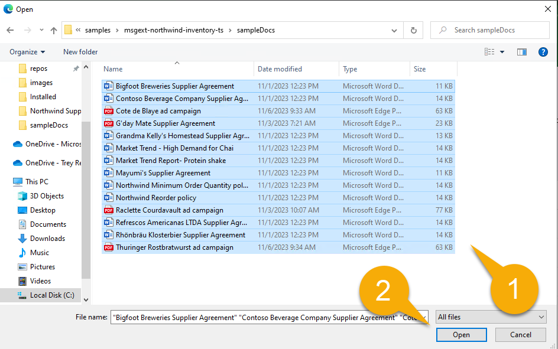

---
lab:
  title: Preparación del entorno de desarrollo
  module: 'LAB 02: Build your own message extension plugin with TypeScript (TS) for Microsoft Copilot'
---

# Preparación del entorno de desarrollo

Primero vamos a preparar el entorno de desarrollo, las cuentas y el software. Antes de comenzar, debes completar las siguientes tareas:

## Tarea 1: Requisitos previos de instalación

> [!IMPORTANT]
> Para completar este proyecto correctamente, necesitarás una cuenta de Microsoft 365 con permiso para cargar aplicaciones. Para completar el **ejercicio 2**, la cuenta también debe tener licencia para Microsoft Copilot para Microsoft 365.

Si usas un nuevo inquilino, antes de comenzar es recomendable iniciar sesión en la [página de Microsoft 365](https://office.com) en [https://office.com](https://office.com). En función de cómo se configure el inquilino, es posible que se te pida que configures la autenticación multifactor. Asegúrate de que puedes acceder a Microsoft Teams y Microsoft Outlook antes de continuar.

Las siguientes herramientas ya se han instalado en el laboratorio en **MS-4010-CLIENT01**. Asegúrate de que están instalados y operables:

1. [Visual Studio Code](https://code.visualstudio.com/) (versión más reciente)

1. [Explorador de Azure Storage](https://azure.microsoft.com/products/storage/storage-explorer/): descarga esta opción si deseas ver y editar la base de datos de Northwind usada en este ejemplo.

<!--## Task 2 - Install nvm-windows

You'll use this tool to install Node.js and optionally switch Node versions as needed for your projects.

1. In a web browser, navigate to [https://github.com/coreybutler/nvm-windows/releases](https://github.com/coreybutler/nvm-windows/releases).
2. Locate the latest release version and select the **nvm-setup.zip** file to download.  The file will be downloaded to your machine.
3. Open the file folder and **extract** the contents of the zip folder to a folder on your machine.
4. From the new folder, select **nvm-setup.exe** to open the setup file.
5. Follow the prompts in the installer to install the tool using the default options.
6. Nvm for Windows will be installed on your machine.

## Task 3 - Install Node.js

Install Node.js version 18.18.2, which is compatible with all of the solutions in this course.

1. Open the **Command Prompt** application.
2. Enter the command `nvm install 18.18` to install Node.js.
3. The nvm output should confirm that installation is complete.
4. Run the command `nvm use 18.18` to use this version of Node.js.
5. Run the command `node -v` to confirm that you have version 18.18.2 installed.

You have now installed and configured Node.js version 18.18.2-->

## Tarea 2: Descarga del código de ejemplo

[Descarga](https://github.com/OfficeDev/Copilot-for-M365-Plugins-Samples/) el repositorio de ejemplo como un archivo ZIP y extráelo en la **carpeta Documents**:

```text
https://github.com/OfficeDev/Copilot-for-M365-Plugins-Samples/
```

En directorio, ve a la carpeta **samples/msgext-northwind-inventory-ts**. Estos laboratorios harán referencia a esto como la "**carpeta de trabajo**", ya que aquí es donde trabajarás.

## Tarea 3: Copia de los documentos de ejemplo en OneDrive

La aplicación de ejemplo incluye algunos documentos para que Copilot haga referencia durante los laboratorios. En esta tarea, copiarás estos archivos en OneDrive del usuario para que Copilot pueda encontrarlos. En función de cómo se configure el inquilino, es posible que se te pida que configures la autenticación multifactor como parte de este proceso.

1. Abre el explorador web y ve a Microsoft 365 ([https://www.office.com/](https://www.office.com/)). Inicia sesión con la cuenta de Microsoft 365 que usarás en todo el laboratorio. Se te puede pedir que configures la autenticación multifactor.

1. Con el menú de aplicaciones en la esquina superior izquierda de la página 1️⃣, ve a la aplicación de OneDrive en Microsoft 365 2️⃣.

    

1. En OneDrive, ve a **Mis archivos** 1️⃣. Si hay una carpeta de documentos, ve también a ella. Si no es así, puedes trabajar directamente en la ubicación de **Mis archivos**.

    

1. Ahora selecciona **Agregar nuevo** 1️⃣ y **Carpeta** 2️⃣ para crear una nueva carpeta.

    

1. Denomina la carpeta **Northwind contracts** y selecciona **Crear**.

    

1. Ahora, en esta nueva carpeta, selecciona otra vez **Agregar nuevo** 1️⃣, pero esta vez selecciona **Cargar archivos** 2️⃣.

    

1. Ahora ve a la carpeta **sampleDocs** dentro de la **carpeta de trabajo**. Resalta todos los archivos 1️⃣ y selecciona **Aceptar** 2️⃣ para cargarlos todos.

    

Al realizar esta tarea pronto, es probable que el motor de búsqueda de Microsoft 365 los haya descubierto cuando estés listo para ellos.

## Tarea 4: Configuración del kit de herramientas de Teams para Visual Studio Code

En esta tarea, instalarás la versión actual del [kit de herramientas de Teams para Visual Studio Code](https://learn.microsoft.com/microsoftteams/platform/toolkit/teams-toolkit-fundamentals?pivots=visual-studio-code-v5). La manera más fácil de hacerlo es directamente desde Visual Studio Code.

1. Abre la **carpeta de trabajo** en Visual Studio Code. Es posible que se te pida que confíes en los autores de esta carpeta; si es así, hazlo. En el **menú Archivo de Visual Studio Code**, selecciona **Open Folder** y abre directamente la carpeta **msgext-northwind-inventory-ts**.

1. Ahora selecciona el icono del **kit de herramientas de Teams** en el 1️⃣ izquierdo. Si te ofrece opciones para crear un nuevo proyecto, es probable que estés en la carpeta incorrecta.  Debes ver las secciones de Accounts, Environment, etc. como se muestra a continuación.

1. En **Accounts**, selecciona **Sign in to Microsoft 365** 2️⃣ e inicia sesión con tu cuenta de Microsoft 365.

    

1. Se abrirá una ventana del explorador y se te ofrecerá iniciar sesión en Microsoft 365. Cuando diga **You are signed in now and close this page**, hazlo.

1. Por último, comprueba que aparece una marca de verificación verde junto a **Custom app Upload enabled**. Si no es así, significa que la cuenta de usuario no tiene permiso para cargar aplicaciones de Teams. Este permiso está "desactivado" de forma predeterminada; estas son las [instrucciones para permitir que los usuarios carguen aplicaciones personalizadas](https://learn.microsoft.com/microsoftteams/teams-custom-app-policies-and-settings#allow-users-to-upload-custom-apps).

    

## Comprobar el trabajo

Después de seguir todas las tareas anteriores, debes tener instalado y descargado lo siguiente en el equipo:

- [Visual Studio Code](https://code.visualstudio.com/) (versión más reciente)

- [Node.js versión 18.x](https://nodejs.org/download/release/v18.18.2/)

- [Explorador de Azure Storage](https://azure.microsoft.com/products/storage/storage-explorer/) (OPCIONAL)

- [Kit de herramientas de Teams para Visual Studio Code](https://learn.microsoft.com/microsoftteams/platform/toolkit/teams-toolkit-fundamentals?pivots=visual-studio-code-v5)

- Repositorio de ejemplo: [https://github.com/OfficeDev/Copilot-for-M365-Plugins-Samples/](https://github.com/OfficeDev/Copilot-for-M365-Plugins-Samples/)

Si todo se ha preparado correctamente, ya estás listo para ejecutar la aplicación de ejemplo como una extensión de mensajes. 

[Ir al ejercicio siguiente... ](./3-exercise-1-run-message-extension.md)