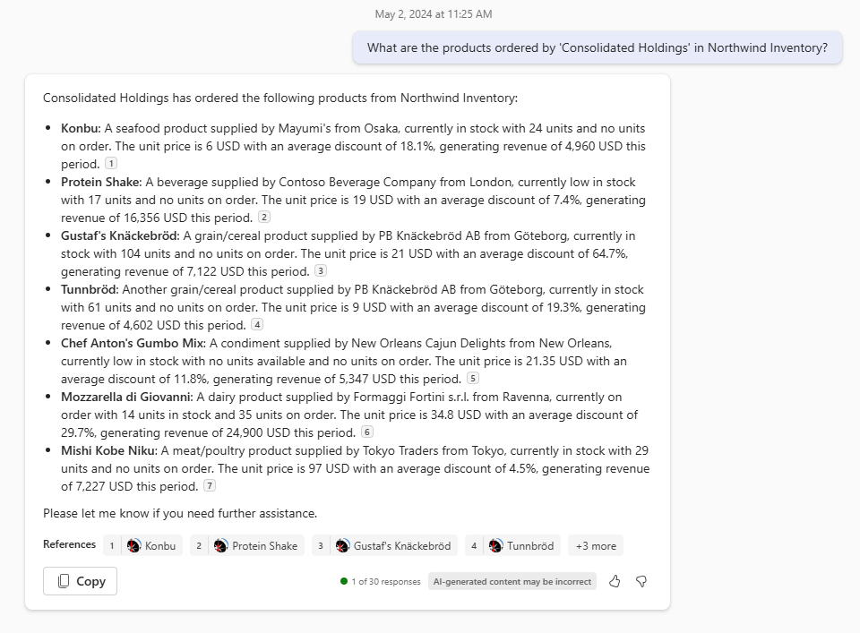

---
lab:
  title: 'Ejercicio 3: Agregar un nuevo comando'
  module: 'LAB 02: Build your own message extension plugin with TypeScript (TS) for Microsoft 365 Copilot'
---

# Ejercicio 3: Agregar un nuevo comando

En este ejercicio, mejorarás la extensión de mensajes de Teams y el complemento de Copilot agregando un nuevo comando. Aunque la extensión de mensajes actual proporciona eficazmente información sobre los productos dentro de la base de datos de inventario de Northwind, no proporciona información relacionada con los clientes de Northwind. Introducirás un nuevo comando asociado a una llamada API que recupera los productos pedidos por un nombre de cliente especificado por el usuario. En este ejercicio se supone que has completado al menos los ejercicios 1, 2 y 3. Puedes omitir el ejercicio 4 en caso de que no tengas una licencia de Microsoft 365 Copilot.

Realizaremos las siguientes tareas para lograr esto:

1. **Extender la extensión de mensajes o la interfaz de usuario del complemento** modificando el manifiesto de la aplicación de Teams. Esto incluye la introducción de un nuevo comando: **"companySearch"**. Observa que la interfaz de usuario de la extensión de mensaje es una tarjeta adaptable, mientras que para Copilot es la entrada de texto y la salida en el chat de Copilot.

1. **Crear un controlador para el comando "companySearch"**. Esto analizará la cadena de consulta pasada desde el código de enrutamiento de mensajes, validará la entrada y llamará a la API de búsqueda de productos por empresa. Esta tarea también rellenará una tarjeta adaptable con la lista de productos devuelta, que se mostrará en el mensaje o en la interfaz de usuario de chat de Copilot.

1. Actualizar el código de **enrutamiento** de comandos para enrutar el nuevo comando al controlador creado en la tarea anterior. Para ello, extenderás el método llamado por Bot Framework cuando los usuarios consulten la base de datos de Northwind (**handleTeamsMessagingExtensionQuery**). 

1. **Implementar la búsqueda de productos por empresa** que devuelve una lista de productos pedidos por esa empresa.

1. **Ejecutar la aplicación** y buscar los productos adquiridos por una empresa especificada.

## Tarea 1: Extensión de la extensión de mensajes o la interfaz de usuario del complemento 

1. En Visual Studio Code en la **carpeta de trabajo**, abre **manifest.json** y agrega el siguiente json inmediatamente después del comando `discountSearch` (**línea 98**). Con esta información adicional, agregas a la matriz `commands` que define la lista de comandos admitidos por el complemento.

   ```json
   {
       "id": "companySearch",
       "context": [
           "compose",
           "commandBox"
       ],
       "description": "Given a company name, search for products ordered by that company",
       "title": "Customer",
       "type": "query",
       "parameters": [
           {
               "name": "companyName",
               "title": "Company name",
               "description": "The company name to find products ordered by that company",
               "inputType": "text"
           }
       ]
   }
   ```

> [!NOTE] 
> El **id.** es la conexión entre la interfaz de usuario y el código. Este valor se define como **COMMAND_ID** en los archivos **discount\product\SearchCommand.ts**. Observa cómo cada uno de estos archivos tiene un **COMMAND_ID** único que corresponde al valor de **id**.

## Tarea 2: Creación de un controlador para el comando "companySearch".

En este ejercicio, copiaremos parte del código existente para crear nuevos controladores para nuestros comandos. 

1. En Visual Studio Code, en tu **directorio de trabajo**, ve a **.\src\messageExtensions** y copia "**productSearchCommand.ts**" y pega en la misma carpeta para crear una copia. Cambia el nombre de este archivo **customerSearchCommand.ts**.

1. Cambia la línea 7 a:

    ```typescript
    import { searchProductsByCustomer } from "../northwindDB/products";
    ```

1. Cambia la línea 10 a:

   ```javascript
   const COMMAND_ID = "companySearch";
   ```


1. Reemplaza el contenido de **handleTeamsMessagingExtensionQuery** por:

   ```javascript
    {
       let companyName;
   
       // Validate the incoming query, making sure it's the 'companySearch' command
       // The value of the 'companyName' parameter is the company name to search for
       if (query.parameters.length === 1 && query.parameters[0]?.name === "companyName") {
           [companyName] = (query.parameters[0]?.value.split(','));
       } else { 
           companyName = cleanupParam(query.parameters.find((element) => element.name === "companyName")?.value);
       }
       console.log(`🍽️ Query #${++queryCount}:\ncompanyName=${companyName}`);    
   
       const products = await searchProductsByCustomer(companyName);
   
       console.log(`Found ${products.length} products in the Northwind database`)
       const attachments = [];
       products.forEach((product) => {
           const preview = CardFactory.heroCard(product.ProductName,
               `Customer: ${companyName}`, [product.ImageUrl]);
   
           const resultCard = cardHandler.getEditCard(product);
           const attachment = { ...resultCard, preview };
           attachments.push(attachment);
       });
       return {
           composeExtension: {
               type: "result",
               attachmentLayout: "list",
               attachments: attachments,
           },
       };
   }
   ```

> [!NOTE]
> Implementarás `searchProductsByCustomer` en la tarea 4.

## Tarea 3: Actualización del enrutamiento de comandos

En esta tarea, enrutarás el comando `companySearch` al controlador que implementaste en la tarea anterior.

1. Abre **searchApp.ts** y busca lo siguiente en la **línea 10**:

   ```javascript
   import discountedSearchCommand from "./messageExtensions/discountSearchCommand";
   ```

1. Agrega esto como **línea 11**:

   ```javascript
   import customerSearchCommand from "./messageExtensions/customerSearchCommand";
   ```

1. Debajo de esta instrucción:

   ```javascript
         case discountedSearchCommand.COMMAND_ID: {
           return discountedSearchCommand.handleTeamsMessagingExtensionQuery(context, query);
         }
   ```

1. Agrega a esta instrucción:

   ```javascript
         case customerSearchCommand.COMMAND_ID: {
           return customerSearchCommand.handleTeamsMessagingExtensionQuery(context, query);
         }
   ```

> [!NOTE]
> Se llama explícitamente a la operación basada en la interfaz de usuario del complemento. Sin embargo, cuando Microsoft 365 Copilot la invoca, el orquestador de Copilot desencadena el comando.

## Tarea 4: Implementación de la búsqueda de productos por empresa

En esta tarea, implementarás una búsqueda de productos **por nombre de empresa** y devolverás una lista de los productos pedidos de la empresa. La salida de la tabla de la consulta tendrá este aspecto:

| Table         | Find        | Look Up By    |
| ------------- | ----------- | ------------- |
| Customer      | Customer ID | Customer Name |
| Orders        | Order ID    | Customer ID   |
| OrderDetail   | Product     | Order ID      |

Así es cómo funciona la consulta: 

1. Usa la tabla **Customer** para buscar el **Customer Id** con el **Customer Name**. 

1. Consulta la tabla **Orders** con el **Customer Id** para recuperar los **Order Ids** asociados. 

1. Para cada **Order Id**, busca los productos asociados en la tabla **OrderDetail**. 

1. Por último, devuelve una lista de productos pedidos por el nombre de empresa especificado.

Ahora, modificaremos el archivo **products.ts** para agregar la nueva consulta de búsqueda.

1. Abre **.\src\northwindDB\products.ts**

1. Actualiza la instrucción `import` de la línea 1 para incluir OrderDetail, Order y Customer. Debería tener el siguiente aspecto:

   ```javascript
   import {
       TABLE_NAME, Product, ProductEx, Supplier, Category, OrderDetail,
       Order, Customer
   } from './model';
   ```

1. Debajo de esto en la **línea 8**:

   ```javascript
   import { getInventoryStatus } from '../adaptiveCards/utils';
   ```

       Add the new function `searchProductsByCustomer()`:

   ```javascript
   export async function searchProductsByCustomer(companyName: string): Promise<ProductEx[]> {

       let result = await getAllProductsEx();
   
       let customers = await loadReferenceData<Customer>(TABLE_NAME.CUSTOMER);
       let customerId="";
       for (const c in customers) {
           if (customers[c].CompanyName.toLowerCase().includes(companyName.toLowerCase())) {
               customerId = customers[c].CustomerID;
               break;
           }
       }
       
       if (customerId === "") 
           return [];

       let orders = await loadReferenceData<Order>(TABLE_NAME.ORDER);
       let orderdetails = await loadReferenceData<OrderDetail>(TABLE_NAME.ORDER_DETAIL);
       // build an array orders by customer id
       let customerOrders = [];
       for (const o in orders) {
           if (customerId === orders[o].CustomerID) {
               customerOrders.push(orders[o]);
           }
       }
       
       let customerOrdersDetails = [];
       // build an array order details customerOrders array
       for (const od in orderdetails) {
           for (const co in customerOrders) {
               if (customerOrders[co].OrderID === orderdetails[od].OrderID) {
                   customerOrdersDetails.push(orderdetails[od]);
               }
           }
       }

       // Filter products by the ProductID in the customerOrdersDetails array
       result = result.filter(product => 
           customerOrdersDetails.some(order => order.ProductID === product.ProductID)
       );

       return result;
   }
   ```

## Tarea 5: Ejecución de la aplicación Buscar producto por nombre de empresa

Ahora estás listo para probar el ejemplo como complemento para Microsoft 365 Copilot.

1. Elimina la aplicación **Northwest Inventory** en Teams. Esta tarea es necesaria, ya que estás actualizando el manifiesto. Las actualizaciones del manifiesto requieren que se vuelva a instalar la aplicación. La manera más limpia de hacerlo es eliminarla primero de Teams.

    1. En la barra lateral de Teams, selecciona los tres puntos (...) 1️⃣. Deberías ver **Northwind Inventory** 2️⃣ en la lista de aplicaciones.

    1. Haz clic con el botón derecho en el icono **Northwest Inventory** y selecciona desinstalar 3️⃣.

        

1. Inicia la aplicación en Visual Studio Code con el perfil **Debug in Teams (Edge)** presionando **F5**.

1. En Teams, selecciona **Chat** y luego **Copilot**. Copilot debe ser la opción superior.

1. Selecciona el **icono del complemento** y selecciona **Northwind Inventory** para habilitar el complemento.

1. Introduce el mensaje: 

   ```console
   What are the products ordered by 'Consolidated Holdings' in Northwind Inventory?
   ```

   La salida del terminal muestra que Copilot entendió la consulta y ejecutó el comando `companySearch`, pasando el nombre de la empresa extraído por Copilot.

   

   Esta es la salida de Copilot:

   

Estas son otros mensajes para probar:

```console
What are the products ordered by 'Consolidated Holdings' in Northwind Inventory? Please list the product name, price and supplier in a table.
```

Por supuesto, también puedes probar este nuevo comando con el ejemplo como una extensión de mensajes, como hicimos en el ejercicio anterior. 

1. En la barra lateral de Teams, ve a la sección **Chats** y elige cualquier chat o inicia un nuevo chat con un compañero.

1. Selecciona el signo **+** para acceder al menú Aplicaciones.

1. Elige la aplicación **Northwind Inventory**.

1. Observa cómo ahora puedes ver una nueva pestaña denominada **Customer**.

1. Busca **Consolidated Holdings** y mira los productos pedidos por esta empresa. Coincidirán con los que Copilot devolvió en la tarea anterior.

    

## Comprobar el trabajo

Después de completar el ejercicio, debes tener un nuevo comando para buscar pedidos por empresa en la aplicación Northwind Inventory. También debes poder usar correctamente el complemento con Copilot y como una extensión de mensajes en otras aplicaciones. 

En el ejercicio siguiente, explorarás el código fuente del complemento y las tarjetas adaptables para obtener más información sobre cómo se compilan las aplicaciones y cómo personalizarlas aún más.

[Ir al ejercicio siguiente...](./6-exercise-4-explore-plugin-source-code.md)