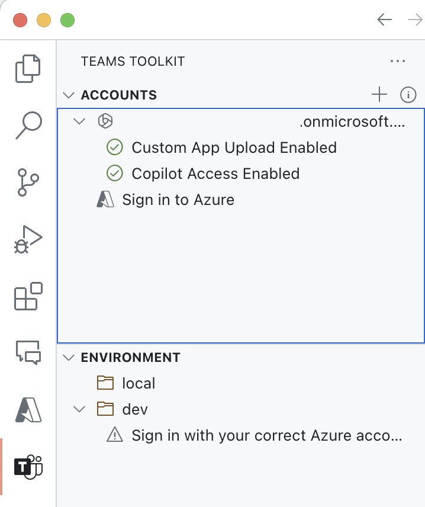

---
lab:
  title: 'Ejercicio 4: Prueba del agente declarativo con el complemento de API en Microsoft 365 Copilot'
  module: 'LAB 02: Build your first action for declarative agents with API plugin by using Visual Studio Code'
---

# Ejercicio 4: Prueba del agente declarativo con el complemento de API en Microsoft 365 Copilot

La extensión de un agente declarativo con acciones permite recuperar y actualizar los datos almacenados en sistemas externos en tiempo real. Mediante complementos de API, puedes conectarte a sistemas externos a través de sus API para recuperar y actualizar información.

### Duración del ejercicio

- **Tiempo estimado para completarlo**: 10 minutos

## Tarea 1: Probar el agente declarativo

El último paso es probar el agente declarativo con el complemento de API en Microsoft 365 Copilot.

En Visual Studio Code:

1. En la **Barra de actividades**, elige **Kit de herramientas de Teams**.
1. En la sección **Cuentas**, asegúrate de haber iniciado sesión en tu inquilino de Microsoft 365 con Microsoft 365 Copilot.

  

1. En la **Barra de actividades**, elige **Ejecutar y depurar**.
1. Selecciona la configuración **Depurar en Copilot** e inicia la depuración con el botón **Iniciar depuración**.  

  

1. Visual Studio Code compila e implementa el proyecto en el inquilino de Microsoft 365 y abre una nueva ventana del explorador web.

En el explorador web:

1. Cuando se te solicite, inicia sesión con la cuenta que pertenece al inquilino de Microsoft 365 con Microsoft 365 Copilot.
1. En la barra lateral, selecciona **Il Ristorante**.

  

1. Elige el inicio de conversación **¿Qué hay para comer hoy?** y envía la solicitud.

  

1. Cuando se te solicite, examina los datos que el agente envía a la API y confírmalos con el botón **Permitir una vez**.

  

1. Espera a que el agente responda. Observa que, aunque muestra citas para la información que recupera de la API, el elemento emergente solo muestra el título del plato. No muestra información adicional, ya que el complemento de API no define una plantilla de tarjeta adaptable.

  

1. Realiza un pedido al escribir en el cuadro de texto: **1x espaguetis, 1x té helado** y envía la indicación.
1. Examina los datos que el agente envía a la API y continúa con el botón **Confirmar**.

  

1. Espera a que el agente realice el pedido y devuelva el resumen del pedido. Una vez más, observa que el agente muestra el resumen del pedido en texto sin formato porque no tiene una plantilla de tarjeta adaptable.

  

1. Regresa a Visual Studio Code y detén la depuración.
1. Cambia a la pestaña **Terminal** y cierra todos los terminales activos.

  
