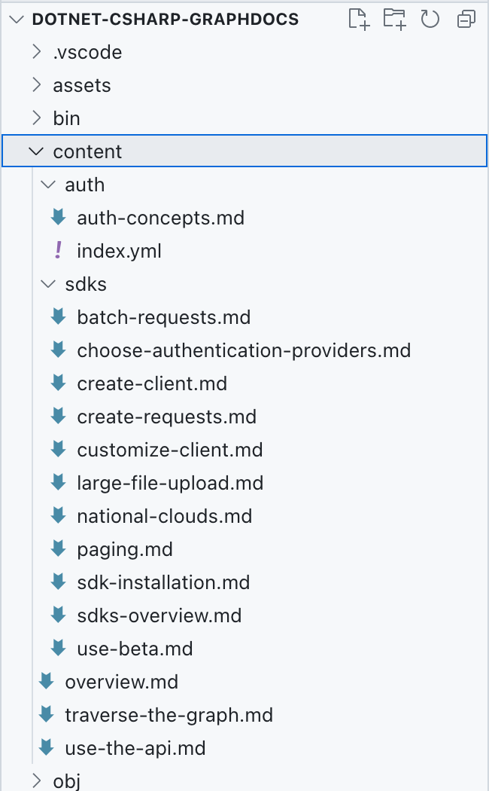

---
lab:
  title: 'Ejercicio 2: Importación de contenido externo'
  module: 'LAB 02: Integrate external content with Copilot for Microsoft 365 using Microsoft Graph connectors built with .NET'
---

# Ejercicio: Importación de contenido externo

En este ejercicio, extenderás el conector personalizado de Microsoft Graph con el código para importar archivos Markdown locales a Microsoft 365.

## Antes de comenzar

Este ejercicio tarda unos **XX minutos** en completarse.

## Tarea 1: Descargar el contenido externo

Para seguir este ejercicio, copia los archivos de contenido de ejemplo usados en este ejercicio desde [GitHub](https://pnp.github.io/download-partial/?url=https://github.com/pnp/graph-connectors-samples/tree/main/samples/dotnet-csharp-graphdocs/content) y almacénelos en el proyecto, en la carpeta denominada **content**.



Para que el código funcione correctamente, la carpeta **content** y su contenido deben copiarse en la carpeta de salida de compilación.

En el editor de código:

1. Abre el archivo **.csproj** y justo antes de la etiqueta `</Project>` agrega el código siguiente:

   ```xml
   <ItemGroup>
     <ContentFiles Include="content\**"    CopyToOutputDirectory="PreserveNewest" />
   </ItemGroup>
   
   <Target Name="CopyContentFolder" AfterTargets="Build">
     <Copy SourceFiles="@(ContentFiles)" DestinationFiles="@   (ContentFiles->'$(OutputPath)\content\%(RecursiveDir)%(Filename)%   (Extension)')" />
   </Target>
   ```

1. Guarda los cambios.

## Tarea 2: Adición de bibliotecas para analizar Markdown y YAML

El conector de Microsoft Graph que compilarás importa archivos Markdown locales a Microsoft 365. Cada uno de estos archivos contiene un encabezado con metadatos en formato YAML, también conocido como frontmatter. Además, el contenido de cada archivo se escribe en Markdown. Para extraer los metadatos y convertir el cuerpo en HTML, usa las bibliotecas personalizadas:

1. Abre un terminal y cambia el directorio de trabajo a tu proyecto.
1. Para agregar la biblioteca de procesamiento de Markdown, ejecuta el siguiente comando: `dotnet add package Markdig`.
1. Para agregar la biblioteca de procesamiento de YAML, ejecuta el siguiente comando: `dotnet add package YamlDotNet`.

## Tarea 3: Definición de la clase para representar el archivo importado

Para simplificar el trabajo con archivos Markdown importados y su contenido, vamos a definir una clase con las propiedades necesarias.

En el editor de código:

1. Crea un nuevo archivo denominado **ContentService.cs**.
1. Agrega el siguiente código:

   ```csharp
   using YamlDotNet.Serialization;
   
   public interface IMarkdown
   {
     string? Markdown { get; set; }
   }
   
   class DocsArticle : IMarkdown
   {
     [YamlMember(Alias = "title")]
     public string? Title { get; set; }
     [YamlMember(Alias = "description")]
     public string? Description { get; set; }
     public string? Markdown { get; set; }
     public string? Content { get; set; }
     public string? RelativePath { get; set; }
   }
   ```

   La interfaz `IMarkdown` representa el contenido del archivo Markdown local. Se debe definir por separado para admitir la deserialización del contenido del archivo. La clase `DocsArticle` representa el documento final con propiedades YAML analizadas y contenido HTML. Los atributos `YamlMember` asignan propiedades a los metadatos en el encabezado de cada documento.

1. Guarda los cambios.

## Tarea 4: Definición de la clase `ContentService`

A continuación, crea una clase que contenga el código para cargar archivos Markdown locales, transformarlos en elementos externos y cargarlos en Microsoft 365.

En el editor de código:

1. Comprueba que estás editando el archivo **ContentService.cs**.
1. En la parte superior del archivo agrega la siguiente instrucción using:

   ```csharp
   using Microsoft.Graph.Models.ExternalConnectors;
   ```

1. Después, agrega el siguiente código al final del archivo:

   ```csharp
   static class ContentService
   {
     static IEnumerable<DocsArticle> Extract()
     {}
   
     static IEnumerable<ExternalItem> Transform(IEnumerable<DocsArticle>    content)
     {}
   
     static async Task Load(IEnumerable<ExternalItem> items)
     {}
   
     public static async Task LoadContent()
     {
       var content = Extract();
       var transformed = Transform(content);
       await Load(transformed);
     }
   }
   ```

   La clase `ContentService` define tres métodos que representan el proceso de control de contenido:

   1. `Extract`, que carga los archivos Markdown locales y los analiza en instancias de la clase `DocsArticle` para facilitar el control.
   1. `Transform`, que convierte los objetos `DocsArticle` en instancias de la clase `ExternalItems`, que forma parte Microsoft Graph .NET SDK y que representa los elementos externos que se cargarán en Microsoft 365.
   1. `Load`, que carga elementos externos en Microsoft 365 mediante Microsoft Graph API.

   Estos métodos se llaman en este orden específico desde el método `LoadContent`.

1. Guarda los cambios.

## Tarea 5: Configuración del procesamiento de Markdown

Comencemos con la extracción del contenido de los archivos Markdown locales.

Agrega primero los métodos auxiliares para usar fácilmente las bibliotecas `Markdig` y `YamlDotNet`.

En el editor de código:

1. Crea un nuevo archivo denominado **MarkdownExtensions.cs**.
1. En el archivo, agrega el código siguiente:

   ```csharp
   // from: https://khalidabuhakmeh.com/parse-markdown-front-matter-with-csharp
   using Markdig;
   using Markdig.Extensions.Yaml;
   using Markdig.Syntax;
   using YamlDotNet.Serialization;
   
   public static class MarkdownExtensions
   {
     private static readonly IDeserializer YamlDeserializer =
         new DeserializerBuilder()
         .IgnoreUnmatchedProperties()
         .Build();
         
     private static readonly MarkdownPipeline Pipeline
         = new MarkdownPipelineBuilder()
         .UseYamlFrontMatter()
         .Build();
   }
   ```

   La propiedad `YamlDeserializer` define un nuevo deserializador para el bloque YAML en cada uno de los archivos Markdown que vas a extraer. Has configurado el deserializador para omitir todas las propiedades que no forman parte de la clase a la que se deserializa el archivo.

   La propiedad `Pipeline` define una canalización de procesamiento para el analizador de Markdown. Lo configuras para analizar el encabezado YAML. Sin esta configuración, se descartaría la información del encabezado.

1. Luego extiende la clase `MarkdownExtensions` con el código siguiente:

   ```csharp
   public static T GetContents<T>(this string markdown) where T :    IMarkdown, new()
   {
     var document = Markdown.Parse(markdown, Pipeline);
     var block = document
         .Descendants<YamlFrontMatterBlock>()
         .FirstOrDefault();
   
     if (block == null)
       return new T { Markdown = markdown };
   
     var yaml =
         block
         // this is not a mistake
         // we have to call .Lines 2x
         .Lines // StringLineGroup[]
         .Lines // StringLine[]
         .OrderByDescending(x => x.Line)
         .Select(x => $"{x}\n")
         .ToList()
         .Select(x => x.Replace("---", string.Empty))
         .Where(x => !string.IsNullOrWhiteSpace(x))
         .Aggregate((s, agg) => agg + s);
   
     var t = YamlDeserializer.Deserialize<T>(yaml);
     t.Markdown = markdown.Substring(block.Span.End + 1);
     return t;
   }
   ```

   El método `GetContents` convierte una cadena Markdown con metadatos YAML en el encabezado en el tipo especificado, que implementa la interfaz `IMarkdown`. En la cadena Markdown, extrae el encabezado YAML y lo deserializa en el tipo especificado. Luego extrae el cuerpo del artículo y lo establece en la propiedad `Markdown` para su posterior procesamiento.

1. Guarda los cambios.

## Tarea 6: Extracción de contenido Markdown y YAML

Con los métodos auxiliares, implementa el método Extract para cargar los archivos Markdown locales y extraer información de ellos.

En el editor de código:

1. Abre el archivo **ContentService.cs**.
1. En la parte superior del archivo agrega la siguiente instrucción using:

   ```csharp
   using Markdig;
   ```

1. Después en la clase `ContentService` implementa el método `Extract` con el código siguiente:

   ```csharp
   static IEnumerable<DocsArticle> Extract()
   {
     var docs = new List<DocsArticle>();
   
     var contentFolder = "content";
     var contentFolderPath = Path.Combine(Directory.GetCurrentDirectory(),    contentFolder);
     var files = Directory.GetFiles(contentFolder, "*.md", SearchOption.   AllDirectories);
   
     foreach (var file in files)
     {
       try
       {
         var contents = File.ReadAllText(file);
         var doc = contents.GetContents<DocsArticle>();
         doc.Content = Markdown.ToHtml(doc.Markdown ?? "");
         doc.RelativePath = Path.GetRelativePath(contentFolderPath, file);
         docs.Add(doc);
       }
       catch (Exception ex)
       {
         Console.WriteLine(ex.Message);
       }
     }
   
     return docs;
   }
   ```

   El método comienza con la carga de archivos Markdown desde la carpeta de **contenido** . Para cada archivo, carga su contenido como una cadena. Convierte la cadena en un objeto con los metadatos y el contenido almacenados en propiedades independientes mediante el método de extensión `GetContents` definido anteriormente en la clase `MarkdownExtensions`. Luego convierte la cadena Markdown en HTML. Por último, almacena la ruta de acceso relativa al archivo y agrega el objeto a una colección para su posterior procesamiento.

1. Guarda los cambios.

## Tarea 7: Transformación del contenido en elementos externos

Después de leer el contenido externo, el siguiente paso consiste en transformarlo en elementos externos, que se cargarán en Microsoft 365.

Comienza agregando un método auxiliar que genere un id. único para cada elemento externo en función de su ruta de acceso relativa al archivo.

En el editor de código:

1. Confirma que estás editando el archivo **ContentService.cs**.
1. En la clase `ContentService`, agrega el método siguiente:

   ```csharp
   static string GetDocId(string relativePath)
   {
     var id = relativePath.Replace(Path.DirectorySeparatorChar.ToString(),    "__").Replace(".md", "");
     return id;
   }
   ```

   El método `GetDocId` toma la ruta de acceso relativa al archivo y reemplaza todos los separadores de directorios por un carácter de subrayado doble. Esto es necesario porque los caracteres separadores de la ruta de acceso no se pueden usar en un id. de elemento externo.

1. Guarda los cambios.

Ahora, implementa el método `Transform`, que convierte los objetos que representan archivos Markdown locales en elementos externos de Microsoft Graph.

En el editor de código:

1. Confirma que estás en el archivo **ContentService.cs**.
1. Implementa el método `Transform` con el código siguiente:

   ```csharp
   static IEnumerable<ExternalItem> Transform(IEnumerable<DocsArticle> content)
   {
     var baseUrl = new Uri("https://learn.microsoft.com/graph/");
   
     return content.Select(a =>
     {
       var docId = GetDocId(a.RelativePath ?? '');
       return new ExternalItem
       {
         Id = docId,
         Properties = new()
         {
           AdditionalData = new Dictionary<string, object> {
               { "title", a.Title ?? "" },
               { "description", a.Description ?? "" },
               { "url", new Uri(baseUrl, a.RelativePath!.Replace(".md",    "")).ToString() }
           }
         },
         Content = new()
         {
           Value = a.Content ?? "",
           Type = ExternalItemContentType.Html
         },
         Acl = new()
         {
             new()
             {
               Type = AclType.Everyone,
               Value = "everyone",
               AccessType = AccessType.Grant
             }
         }
       };
     });
   }
   ```

   Define primero una dirección URL base. Esta dirección URL se usa para crear una dirección URL completa para cada elemento, de modo que cuando se muestre el elemento a los usuarios, pueden navegar al elemento original. Luego transforma cada elemento de `DocsArticle` en `ExternalItem`. Empieza obteniendo un id. único para cada elemento en función de su ruta de acceso relativa al archivo. Después crea una nueva instancia de `ExternalItem` y rellena sus propiedades con información de `DocsArticle`. Después establece el contenido del elemento en el contenido HTML extraído del archivo local y establece el tipo de contenido del elemento en HTML. Por último, configura el permiso del elemento para que sea visible para todos los miembros de la organización.

1. Guarda los cambios.

## Tarea 8: Carga de elementos externos en Microsoft 365

El último paso del procesamiento del contenido es cargar los elementos externos transformados en Microsoft 365.

En el editor de código:

1. Comprueba que estás editando el archivo **ContentService.cs**.
1. En la clase `ContentService` implementa el método `Load` con el código siguiente:

   ```csharp
   static async Task Load(IEnumerable<ExternalItem> items)
   {
     foreach (var item in items)
     {
       Console.Write(string.Format("Loading item {0}...", item.Id));
   
       try
       {
         await GraphService.Client.External
           .Connections[Uri.EscapeDataString(ConnectionConfiguration.   ExternalConnection.Id!)]
           .Items[item.Id]
           .PutAsync(item);
   
         Console.WriteLine("DONE");
       }
       catch (Exception ex)
       {
         Console.WriteLine("ERROR");
         Console.WriteLine(ex.Message);
       }
     }
   }
   ```

   Para cada elemento externo, usa el SDK de Microsoft Graph .NET para llamar a Microsoft Graph API y cargar el elemento. En la solicitud, especifica el id. de la conexión externa creada anteriormente, el id. del elemento que se va a cargar y el contenido del elemento completo.

1. Guarda los cambios.

## Tarea 9: Adición del comando de carga de contenido

Antes de que puedas probar el código debes extender la aplicación de consola con un comando que invoque la lógica de carga de contenido.

En el editor de código:

1. Abre el archivo **Program.cs**.
1. Agrega un nuevo comando para cargar contenido con el código siguiente:

    ```csharp
    var loadContentCommand = new Command("load-content", "Loads content   into the external connection");
    loadContentCommand.SetHandler(ContentService.LoadContent);
    ```

1. Registra el comando recién definido con el comando raíz para que se pueda invocar mediante el código siguiente:

     ```csharp
     rootCommand.AddCommand(loadContentCommand);
     ```

1. Guarda los cambios.

## Tarea 10: Probar el código

Lo último que queda es probar que el conector de Microsoft Graph importa correctamente el contenido externo.

1. Abre un terminal.
1. Cambia el directorio de trabajo a la carpeta del proyecto:
1. Ejecuta el comando `dotnet build` para compilar el proyecto.
1. Ejecuta el comando `dotnet run -- load-content` para iniciar la carga del contenido.
1. Espera a que el comando se complete y cargue el contenido.

[Ir al ejercicio siguiente...](./4-exercise-ensure-secure-access.md)