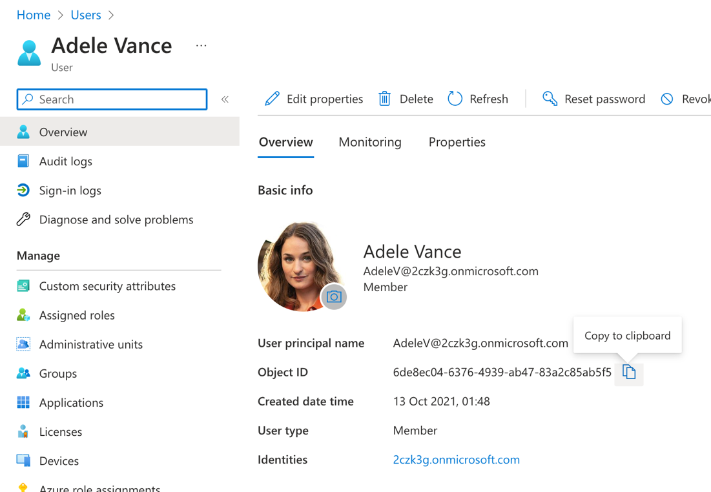

---
lab:
  title: 'Ejercicio 3: Garantizar el acceso seguro con la lista de control de acceso'
  module: 'LAB 02: Integrate external content with Copilot for Microsoft 365 using Microsoft Graph connectors built with .NET'
---

# Ejercicio 3: Garantizar el acceso seguro con la lista de control de acceso

En este ejercicio, actualizarás el código responsable de importar archivos markdowns locales con la configuración ACL en elementos seleccionados.

## Antes de comenzar

Este ejercicio tarda unos **XX minutos** en completarse.

## Tarea 1: Importación de contenido disponible para todos los usuarios de la organización

Cuando implementaste el código para importar contenido externo en el ejercicio anterior, lo configuraste para que estuviera disponible para todos los usuarios de la organización. Este es el código que usaste:

```csharp
static IEnumerable<ExternalItem> Transform(IEnumerable<DocsArticle> content)
{
  var baseUrl = new Uri("https://learn.microsoft.com/graph/");

  return content.Select(a =>
  {
    var docId = GetDocId(a.RelativePath ?? "");

    return new ExternalItem
    {
      Id = docId,
      Properties = new()
      {
        AdditionalData = new Dictionary<string, object> {
            { "title", a.Title ?? "" },
            { "description", a.Description ?? "" },
            { "url", new Uri(baseUrl, a.RelativePath!.Replace(".md", "")).ToString() }
        }
      },
      Content = new()
      {
        Value = a.Content ?? "",
        Type = ExternalItemContentType.Html
      },
      Acl = new()
      {
          new()
          {
            Type = AclType.Everyone,
            Value = "everyone",
            AccessType = AccessType.Grant
          }
      }
    };
  });
}
```

Has configurado la ACL para conceder acceso a todos los usuarios. Vamos a ajustarlo para las páginas de Markdown seleccionadas que vas a importar.

## Tarea 2: Importación de contenido disponible para usuarios seleccionados

Primero, configura una de las páginas que importarás para que solo sea accesible para un usuario específico.

En el explorador web:

1. Ve a Azure Portal en [https://portal.azure.com](https://portal.azure.com) e inicia sesión con tu cuenta profesional o educativa.
1. En la barra lateral, selecciona **Vista** bajo **Microsoft Entra ID**.
1. En el panel de navegación, selecciona **Administrar** > **Usuarios**.
1. En la lista de usuarios, abre uno de los usuarios seleccionando su nombre.
1. Copia el valor de la propiedad **Object ID**.

  

Usa este valor para definir una nueva ACL para una página de Markdown específica.

En el editor de código:

1. Abre el archivo **ContentService.cs** y busca el método `Transform`.
1. Dentro del delegado `Select`, define la ACL predeterminada que se aplica a todos los elementos importados:

   ```csharp
   var acl = new Acl
   {
     Type = AclType.Everyone,
     Value = "everyone",
     AccessType = AccessType.Grant
   };
   ```

1. Luego invalida la ACL predeterminada para el archivo Markdown con el nombre que termina en `use-the-api.md`:

   ```csharp
   if (a.RelativePath!.EndsWith("use-the-api.md"))
   {
     acl = new()
     {
       Type = AclType.User,
       // AdeleV
       Value = "6de8ec04-6376-4939-ab47-83a2c85ab5f5",
       AccessType = AccessType.Grant
     };
   }
   ```

1. Por último, actualiza el código que devuelve el elemento externo para usar la ACL definida:

   ```csharp
   return new ExternalItem
   {
     Id = docId,
     Properties = new()
     {
       AdditionalData = new Dictionary<string, object> {
         { "title", a.Title ?? "" },
         { "description", a.Description ?? "" },
         { "url", new Uri(baseUrl, a.RelativePath!.Replace(".md", "")).   ToString() }
       }
     },
     Content = new()
     {
       Value = a.Content ?? "",
       Type = ExternalItemContentType.Html
     },
     Acl = new()
     {
       acl
     }
   };
   ```

1. El método `Transform` actualizado tiene el siguiente aspecto:

   ```csharp
   static IEnumerable<ExternalItem> Transform(IEnumerable<DocsArticle>    content)
   {
     var baseUrl = new Uri("https://learn.microsoft.com/graph/");
   
     return content.Select(a =>
     {
       var acl = new Acl
       {
         Type = AclType.Everyone,
         Value = "everyone",
         AccessType = AccessType.Grant
       };
   
       if (a.RelativePath!.EndsWith("use-the-api.md"))
       {
         acl = new()
         {
           Type = AclType.User,
           // AdeleV
           Value = "6de8ec04-6376-4939-ab47-83a2c85ab5f5",
           AccessType = AccessType.Grant
         };
       }
   
       var docId = GetDocId(a.RelativePath ?? "");
   
       return new ExternalItem
       {
         Id = docId,
         Properties = new()
         {
           AdditionalData = new Dictionary<string, object> {
             { "title", a.Title ?? "" },
             { "description", a.Description ?? "" },
             { "url", new Uri(baseUrl, a.RelativePath!.Replace(".md", "")).   ToString() }
           }
         },
         Content = new()
         {
           Value = a.Content ?? "",
           Type = ExternalItemContentType.Html
         },
         Acl = new()
         {
           acl
         }
       };
     });
   }
   ```

1. Guarda los cambios.

## Tarea 3: Importación del contenido disponible para un grupo seleccionado

Ahora, vamos a ampliar el código para que otra página solo sea accesible por un grupo de usuarios seleccionado.


Usa este valor para definir una nueva ACL para una página de Markdown específica.

En el editor de código:

1. Abre el archivo **ContentService.cs** y busca el método `Transform`.
1. Amplía la cláusula `if` definida anteriormente, con una condición adicional para definir la ACL para el archivo Markdown con el nombre que termina en `traverse-the-graph.md`:

   ```csharp
   if (a.RelativePath!.EndsWith("use-the-api.md"))
   {
     acl = new()
     {
       Type = AclType.User,
       // AdeleV
       Value = "6de8ec04-6376-4939-ab47-83a2c85ab5f5",
       AccessType = AccessType.Grant
     };
   }
   else if (a.RelativePath.EndsWith("traverse-the-graph.md"))
   {
     acl = new()
     {
       Type = AclType.Group,
       // Sales and marketing
       Value = "a9fd282f-4634-4cba-9dd4-631a2ee83cd3",
       AccessType = AccessType.Grant
     };
   }
   ```

1. El método `Transform` actualizado tiene el siguiente aspecto:

   ```csharp
   static IEnumerable<ExternalItem> Transform(IEnumerable<DocsArticle>    content)
   {
     var baseUrl = new Uri("https://learn.microsoft.com/graph/");
   
     return content.Select(a =>
     {
       var acl = new Acl
       {
         Type = AclType.Everyone,
         Value = "everyone",
         AccessType = AccessType.Grant
       };
   
       if (a.RelativePath!.EndsWith("use-the-api.md"))
       {
         acl = new()
         {
           Type = AclType.User,
           // AdeleV
           Value = "6de8ec04-6376-4939-ab47-83a2c85ab5f5",
           AccessType = AccessType.Grant
         };
       }
       else if (a.RelativePath.EndsWith("traverse-the-graph.md"))
       {
         acl = new()
         {
           Type = AclType.Group,
           // Sales and marketing
           Value = "a9fd282f-4634-4cba-9dd4-631a2ee83cd3",
           AccessType = AccessType.Grant
         };
       }
   
       var docId = GetDocId(a.RelativePath ?? "");
   
       return new ExternalItem
       {
         Id = docId,
         Properties = new()
         {
           AdditionalData = new Dictionary<string, object> {
               { "title", a.Title ?? "" },
               { "description", a.Description ?? "" },
               { "url", new Uri(baseUrl, a.RelativePath!.Replace(".md",    "")).ToString() }
           }
         },
         Content = new()
         {
           Value = a.Content ?? "",
           Type = ExternalItemContentType.Html
         },
         Acl = new()
         {
             acl
         }
       };
     });
   }
   ```

1. Guarda los cambios.

## Tarea 4: Aplicación de las nuevas ACL

El paso final consiste en aplicar las ACL recién configuradas.

1. Abre un terminal y cambia el directorio de trabajo a tu proyecto.
1. Ejecuta el comando `dotnet build` para compilar el proyecto.
1. Ejecuta el comando `dotnet run -- load-content` para iniciar la carga del contenido.

[Ir al ejercicio siguiente...](./5-exercise-enable-inline-results.md)