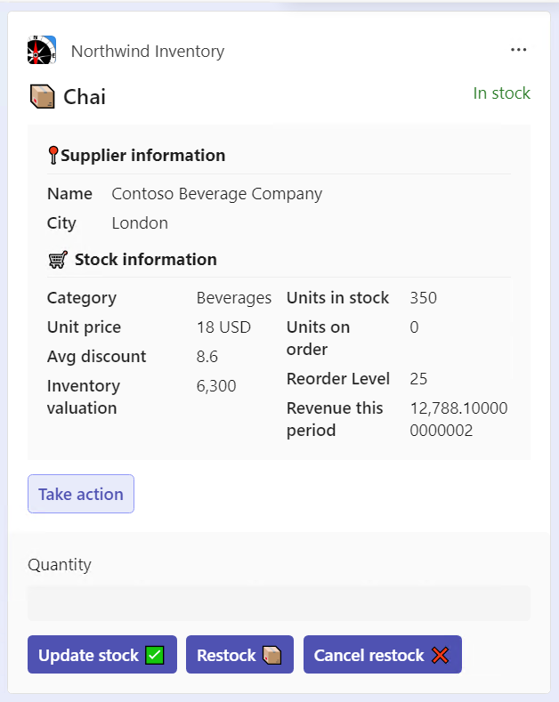

---
lab:
  title: Introducción
  module: 'LAB 03: Build your own message extension plugin with TypeScript (TS) for Microsoft Copilot'
---

# Introducción

En este proyecto, aprenderás a usar las extensiones de mensajes de Teams como complementos en Microsoft Copilot para Microsoft 365. El proyecto se basa en el ejemplo de "Northwind Inventory" incluido en este mismo [repositorio de GitHub](https://github.com/OfficeDev/Copilot-for-M365-Plugins-Samples/tree/main/samples/msgext-northwind-inventory-ts). Al usar la venerable [base de datos de Northwind](https://learn.microsoft.com/dotnet/framework/data/adonet/sql/linq/downloading-sample-databases), tendrás muchos datos empresariales simulados con los que trabajar.

Northwind opera un negocio de comercio electrónico de alimentos especializados en Spokane, Washington. En este laboratorio, trabajarás con la aplicación Northwind Inventory, que proporciona acceso al inventario de productos y a la información financiera.

Este ejercicio debería tardar en completarse **60** minutos aproximadamente.

## Antes de comenzar

- [**Prepárate**](./2-prepare-development-environment.md) primero configurando el entorno de desarrollo y ejecutando la aplicación.

- En el [**ejercicio 1**](./3-exercise-1-run-message-extension.md), ejecutarás la misma aplicación como una [extensión de mensajes](https://learn.microsoft.com/microsoftteams/platform/messaging-extensions/what-are-messaging-extensions) en Microsoft Teams y Outlook.

- En el [**ejercicio 2**](./4-exercise-2-run-copilot-plugin.md), ejecutarás la aplicación como complemento para Copilot para Microsoft 365. Experimentarás con varios mensajes y observarás cómo se invoca el complemento mediante distintos parámetros. Al chatear con Copilot, podrás ver la consola del desarrollador para ver las consultas que está realizando.

- En el [**ejercicio 3**](./5-exercise-3-add-new-command.md), aprenderás a agregar un nuevo comando a la aplicación para que puedas expandir las funcionalidades del complemento y realizar más tareas.

  

- Por último, [**en el ejercicio 4**](./6-exercise-4-explore-plugin-source-code.md), explorarás el código para ver cómo funciona más detalladamente. Si aún no tienes Copilot, todo lo demás seguirá funcionando como una extensión de mensajes para Microsoft 365.

Cuando estés listo para comenzar, selecciona [ir al ejercicio siguiente...](./2-prepare-development-environment.md)