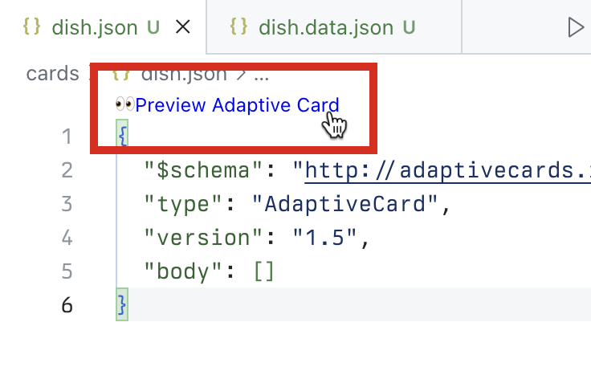
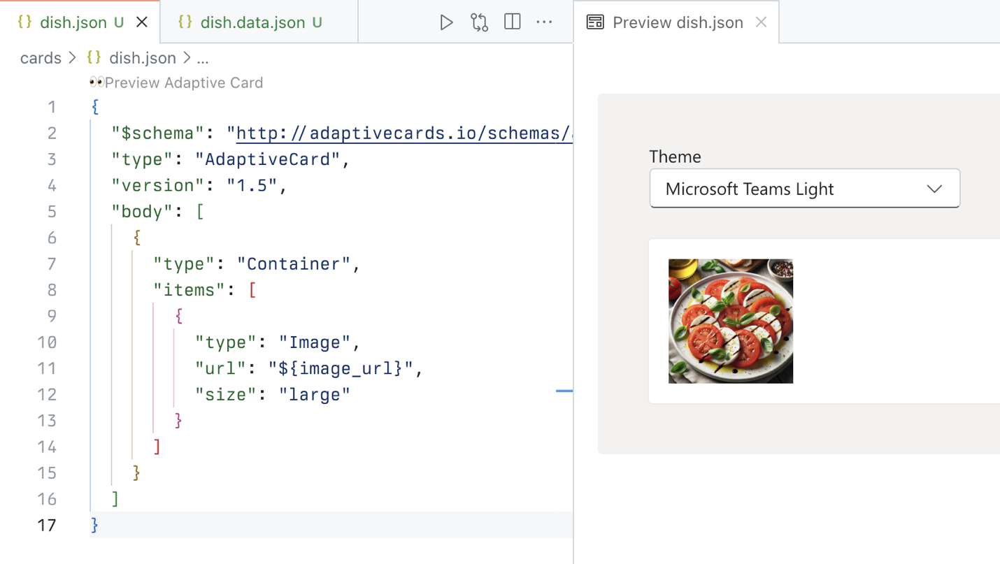
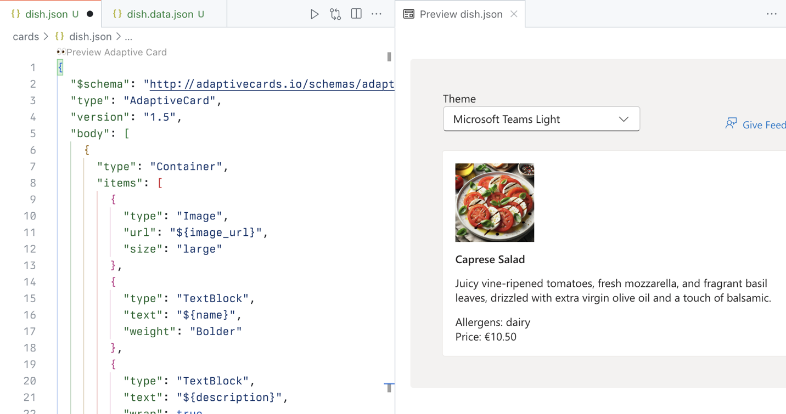
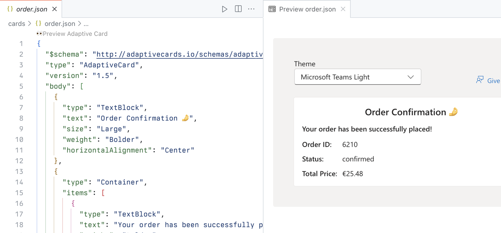

---
lab:
  title: 'Ejercicio 1: Descarga del proyecto y compilación de una tarjeta adaptable'
  module: 'LAB 03: Use Adaptive Cards to show data in API plugins for declarative agents'
---

# Ejercicio 1: Descarga del proyecto y compilación de una tarjeta adaptable

Comencemos creando plantillas de tarjeta adaptable para que el agente muestre los datos en sus respuestas. Para compilar la plantilla de tarjeta adaptable, usa las extensiones de Visual Studio Code del controlador de vista previa de tarjetas adaptables para obtener una vista previa sencilla del trabajo directamente en Visual Studio Code. El uso de la extensión nos permite crear una plantilla Tarjeta adaptable, con referencias a datos. En el entorno de ejecución, el agente rellena el marcador de posición con los datos que recupera de la API.

### Duración del ejercicio

- **Tiempo estimado para completarlo**: 10 minutos

## Tarea 1: Descarga del proyecto de inicio

Empieza descargando el proyecto de ejemplo. En un explorador web:

1. Vaya a [https://github.com/microsoft/learn-declarative-agent-api-plugin-adaptive-cards-typescript](https://github.com/microsoft/learn-declarative-agent-api-plugin-adaptive-cards-typescript).
  1. Sigue los pasos para [descargar el código fuente del repositorio](https://docs.github.com/repositories/working-with-files/using-files/downloading-source-code-archives#downloading-source-code-archives-from-the-repository-view) en el equipo.
  1. Extrae el contenido del archivo ZIP descargado en tu **carpeta de Documentos**.
  1. Abre la carpeta en Visual Studio Code.

El proyecto de ejemplo es un proyecto de Kit de herramientas de Teams que incluye un agente declarativo con una acción creada con un complemento de API. El complemento de API se conecta a una API anónima que se ejecuta en Azure Functions también incluida en el proyecto. La API pertenece a un restaurante italiano ficticio y te permite navegar por el menú del día y hacer pedidos.

## Tarea 2: Crear una tarjeta adaptable para un plato

En primer lugar, crea una tarjeta adaptable que muestre información sobre un solo plato.

En Visual Studio Code:

1. En la vista **Explorador**, crea una nueva carpeta denominada **tarjetas**.
1. En la carpeta **cards**, crea un nuevo archivo denominado **dish.json**. Pega el siguiente contenido que represente una tarjeta adaptable vacía:

  ```json
  {
    "$schema": "http://adaptivecards.io/schemas/adaptive-card.json",
    "type": "AdaptiveCard",
    "version": "1.5",
    "body": []
  }
  ```

1. Antes de continuar, desde la pestaña **Extensiones** de la barra de actividades, busca e instala la extensión **Vista previa de tarjeta adaptable** y después crea un archivo de datos para la tarjeta adaptable:
  1. Abre la paleta de comandos al presionar <kbd>CTRL</kbd>+<kbd>P</kbd> con el teclado. Escribe `>Adaptive` para buscar comandos relacionados con el trabajo con tarjetas adaptables.

    

  1. En la lista, elige **Tarjeta adaptable: nuevo archivo de datos**. Visual Studio Code crea un nuevo archivo denominado **dish.data.json**.
  1. Reemplaza su contenido por un dato que represente un plato:

  ```json
  {
    "id": 4,
    "name": "Caprese Salad",
    "description": "Juicy vine-ripened tomatoes, fresh mozzarella, and fragrant basil leaves, drizzled with extra virgin olive oil and a touch of balsamic.",
    "image_url": "https://raw.githubusercontent.com/pnp/copilot-pro-dev-samples/main/samples/da-ristorante-api/assets/caprese_salad.jpeg",
    "price": 10.5,
    "allergens": [
    "dairy"
    ],
    "course": "lunch",
    "type": "dish"
  }
  ```

  1. Guarda los cambios
1. Vuelve al archivo **dish.json**.
1. En la lente, selecciona **Ver tarjeta adaptable**.

  

  Visual Studio Code abre una vista previa de la tarjeta al lado. A medida que editas la tarjeta, los cambios se ven inmediatamente en el lado.

1. En la matriz **cuerpo**, agrega un elemento **Contenedor** con una referencia a la dirección URL de la imagen almacenada en la propiedad **image_url**.

  ```json
  {
    "type": "Container",
    "items": [
    {
      "type": "Image",
      "url": "${image_url}",
      "size": "large"
    }
    ]
  }
  ```

  Observa cómo la vista previa de la tarjeta se actualiza automáticamente para mostrar la tarjeta:

  

1. Agrega referencias a otras propiedades de plato. Este es el aspecto de la tarjeta completa:

  ```json
  {
    "$schema": "http://adaptivecards.io/schemas/adaptive-card.json",
    "type": "AdaptiveCard",
    "version": "1.5",
    "body": [
    {
      "type": "Container",
      "items": [
      {
        "type": "Image",
        "url": "${image_url}",
        "size": "large"
      },
      {
        "type": "TextBlock",
        "text": "${name}",
        "weight": "Bolder"
      },
      {
        "type": "TextBlock",
        "text": "${description}",
        "wrap": true
      },
      {
        "type": "TextBlock",
        "text": "Allergens: ${if(count(allergens) > 0, join(allergens, ', '), 'none')}",
        "weight": "Lighter"
      },
      {
        "type": "TextBlock",
        "text": "**Price:** €${formatNumber(price, 2)}",
        "weight": "Lighter",
        "spacing": "None"
      }
      ]
    }
    ]
  }
  ```

  

  Observa que para mostrar los alérgenos usas una función para unir los alérgenos en una cadena. Si un plato no tiene alérgenos, muestras **ninguno**. Para asegurar que los precios tienen el formato correcto, usa la función **formatNumber** que nos permite especificar el número de decimales que se mostrarán en la tarjeta.

## Tarea 3: Crear una tarjeta adaptable para el resumen del pedido

La API de ejemplo permite a los usuarios examinar el menú y realizar un pedido. Vamos a crear una tarjeta adaptable que muestre el resumen del pedido.

En Visual Studio Code:

1. En la carpeta **tarjetas**, crea un nuevo archivo denominado **order.json**. Pega el siguiente contenido que represente una tarjeta adaptable vacía:

  ```json
  {
    "$schema": "http://adaptivecards.io/schemas/adaptive-card.json",
    "type": "AdaptiveCard",
    "version": "1.5",
    "body": []
  }
  ```

1. Crea un archivo de datos para la tarjeta adaptable:
  1. Abre la paleta de comandos al presionar <kbd>CTRL</kbd>+<kbd>P</kbd> (<kbd>CMD</kbd>+<kbd>P</kbd> en macOS) con el teclado. Escribe `>Adaptive` para buscar comandos relacionados con el trabajo con tarjetas adaptables.

    

  1. En la lista, elige **Tarjeta adaptable: nuevo archivo de datos**. Visual Studio Code crea un nuevo archivo denominado **order.data.json**.
  1. Reemplaza su contenido por un dato que represente el resumen del pedido:

    ```json
    {
      "order_id": 6210,
      "status": "confirmed",
      "total_price": 25.48
    }
    ```

  1. Guarda los cambios
1. Vuelve al archivo **order.json**.
1. En la lente, selecciona **Ver tarjeta adaptable**.
1. Después, reemplaza el contenido del archivo **order.json** por el siguiente código:

  ```json
  {
    "$schema": "http://adaptivecards.io/schemas/adaptive-card.json",
    "type": "AdaptiveCard",
    "version": "1.5",
    "body": [
    {
      "type": "TextBlock",
      "text": "Order Confirmation 🤌",
      "size": "Large",
      "weight": "Bolder",
      "horizontalAlignment": "Center"
    },
    {
      "type": "Container",
      "items": [
      {
        "type": "TextBlock",
        "text": "Your order has been successfully placed!",
        "weight": "Bolder",
        "spacing": "Small"
      },
      {
        "type": "FactSet",
        "facts": [
        {
          "title": "Order ID:",
          "value": "${order_id} "
        },
        {
          "title": "Status:",
          "value": "${status}"
        },
        {
          "title": "Total Price:",
          "value": "€${formatNumber(total_price, 2)}"
        }
        ]
      }
      ]
    }
    ]
  }
  ```

  Al igual que en la sección anterior, se asigna cada elemento de la tarjeta a una propiedad de datos.

  

  > [!IMPORTANT]
  > Observa el espacio final después de **${order_id}**. Esto es intencionado, debido a un problema conocido con números de representación de tarjetas adaptables. Para probarlo, quita el espacio y observa que el número desaparece de la vista previa.
  >
  > 

  Restaura el espacio final para que la tarjeta se muestre correctamente y guarde los cambios.