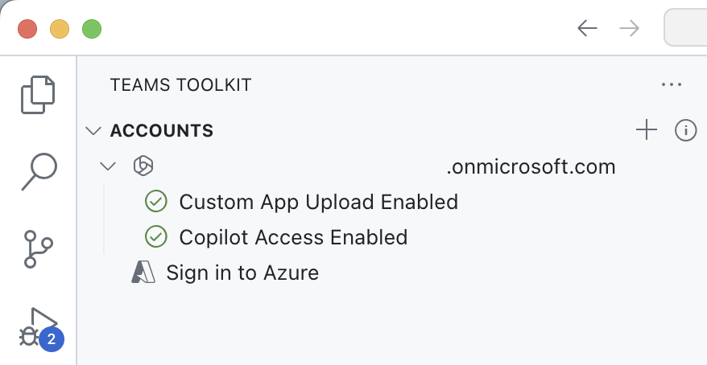

---
lab:
  title: 'Ejercicio 1: Creación de una conexión externa para el conector de Graph'
  module: 'LAB 04: Add custom knowledge to declarative agents using Microsoft Graph connectors and Visual Studio Code'
---

# Ejercicio 1: Creación de una conexión externa para el conector de Graph

La extensión de un agente declarativo con conocimientos le da acceso a información adicional que no forma parte de su modelo de lenguaje grande. Con los conectores de Graph, puedes ingerir datos externos en Microsoft 365, donde está disponible para diferentes experiencias de usuario, incluido Microsoft 365 Copilot. Al configurar las opciones de configuración de conocimientos de un agente de Copilot, puedes integrarlo con una conexión externa creada por un conector de Graph.

### Duración del ejercicio

- **Tiempo estimado para completarlo**: 10 minutos

## Tarea 1: Descargar el proyecto de ejemplo y conexión a los recursos

Al integrar un agente de Copilot con un conector de Graph, debes especificar el Id. de la conexión externa que creó el conector. Normalmente, se implementan conectores de Graph independientes de los agentes de Copilot. Para completar este ejercicio, implementa un conector de Graph existente al que harás referencia en pasos posteriores.

Empieza descargando el proyecto de ejemplo del conector de Graph.

1. En un explorador web, ve a [https://aka.ms/learn-gc-ts-policies](https://aka.ms/learn-gc-ts-policies). Recibirás un mensaje para descargar un archivo ZIP con el proyecto de ejemplo.
1. Guarda el archivo ZIP en el equipo.
    1. Crea una carpeta en **Documentos**.
    1. Extrae el contenido del archivo ZIP descargado en la carpeta que creaste.
    1. Abre la carpeta en Visual Studio Code.

En Visual Studio Code:

1. En el menú File, elige la opción **Open folder...**.
1. Abre la carpeta del proyecto que acabas de extraer en la **carpeta Documentos**.
1. En la **barra Activity**, abre la extensión **Teams Toolkit**.
1. En el panel **Accounts**, confirma que estás conectado al **inquilino de Microsoft 365**.
1. En el panel **Accounts**, confirma que estás conectado a tu **suscripción a Azure**.

    

> [!NOTE]
> Si no tienes una licencia completa de Microsoft 365 Copilot, puedes ver que "Acceso deshabilitado a Copilot". Todavía se pueden completar los ejercicios, aunque es posible que no puedas probar completamente el agente en Microsoft 365 Copilot Chat.

## Tarea 2: Ejecutar el proyecto y creación de una conexión a Microsoft 365

1. Presiona <kbd>F5</kbd> para iniciar el proyecto. El kit de herramientas de Teams crea un nuevo registro de aplicaciones de Microsoft Entra en el inquilino que permite al conector de Graph comunicarse con el inquilino de Microsoft 365. El kit de herramientas de Teams también inicia Azure Function desencadenado por el temporizador que hospeda el conector de Graph.

> [!IMPORTANT]
> Este paso puede tardar hasta 10 minutos o más en completarse, no lo cierres hasta que hayas completado el ejercicio.

1. Para poder ejecutar el conector de Graph, debes dar tu consentimiento a los permisos que necesita la aplicación de Entra. Para conceder consentimiento, usa las instrucciones del panel **Terminal** asociado a la tarea **func: host start**.

    

1. Abre la dirección URL de consentimiento en un explorador web. Inicia sesión con la cuenta profesional que pertenece tu inquilino de Microsoft 365. Concede los permisos necesarios a la aplicación mediante el botón **Grant admin consent**.

    

1. Después de conceder el consentimiento a los permisos necesarios, el conector de Graph continúa. En el panel **Terminal**, observa la salida del conector de Graph. El conector de Graph crea una conexión externa, aprovisiona el esquema e ingiere el contenido de ejemplo en el inquilino de Microsoft 365.
1. La ejecución del conector tarda entre 5 y 10 minutos en completarse. Cuando finalice, detén la depuración presionando el botón **Stop** de la barra de herramientas de depuración.

    
