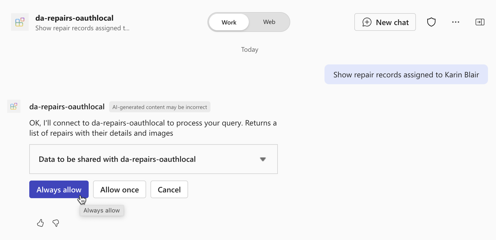

---
lab:
  title: 'Ejercicio 4: Prueba del agente declarativo en Microsoft 365 Copilot Chat'
  module: 'LAB 05: Authenticate your API plugin for declarative agents with secured APIs'
---

# Ejercicio 34: Prueba del agente declarativo en Microsoft 365 Copilot

En este ejercicio, probarás e implementarás el agente declarativo en Microsoft 365 y lo probarás con Microsoft 365 Copilot Chat.

### Duración del ejercicio

- **Tiempo estimado para completarla**: 5 minutos

## Tarea 1: Probar el agente declarativo con el complemento de API en Microsoft 365 Copilot

El último paso es probar el agente declarativo con el complemento de API en Microsoft 365 Copilot.

En Visual Studio Code:

1. En la barra Activity, activa la extensión **Teams Toolkit**.
1. En el panel de extensión de **Teams Toolkit**, en la sección **Accounts**, asegúrate de que has iniciado sesión en tu inquilino de Microsoft 365.

    

1. En la barra Activity, cambia a la vista **Run and Debug**.
1. En la lista de configuraciones, elige **Debug in Copilot (Edge)** y presiona el botón de reproducir para iniciar la depuración.

    

    Visual Studio Code abre un nuevo explorador web con Microsoft 365 Copilot. Si se te solicita, inicia sesión en tu cuenta de Microsoft 365.

En el explorador web:

1. En el panel lateral, selecciona el agente **da-repairs-oauthlocal**.

    

1. Escribe `Show repair records assigned to Karin Blair` en el cuadro de texto de indicación y envía la indicación.

    > [!TIP]
    > En lugar de escribir la indicación, puedes seleccionarla en los temas de conversación.

    

1. Confirma que deseas enviar datos al complemento de API mediante el botón **Always allow**.

    

1. Cuando se te solicite, inicia sesión en la API para seguir usando la misma cuenta que usas para iniciar sesión en el inquilino de Microsoft 365; para ello, selecciona **Sign in to da-repairs-oauthlocal**.

    

1. Espera a que el agente responda.

    

Aunque la API sea accesible de forma anónima porque se ejecuta en el equipo local, Microsoft 365 Copilot llama a la API autenticada como se especifica en la especificación de API. Puedes comprobar que la solicitud contiene un token de acceso estableciendo un punto de interrupción en la función de **reparaciones** y enviando otra indicación al agente declarativo. Cuando el código alcance el punto de interrupción, expande la colección req.headers y busca el encabezado de autorización que contiene un JSON Web Token (JWT).

Detén la sesión de depuración en Visual Studio Code cuando hayas terminado de realizar las pruebas.
